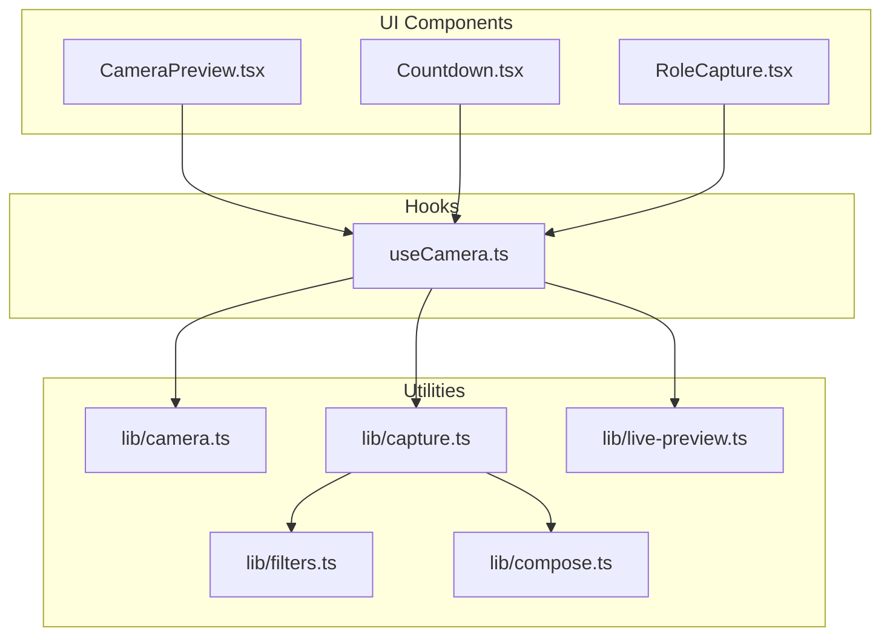
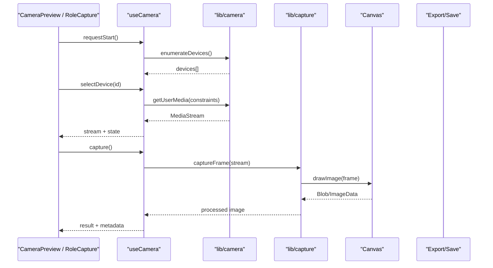
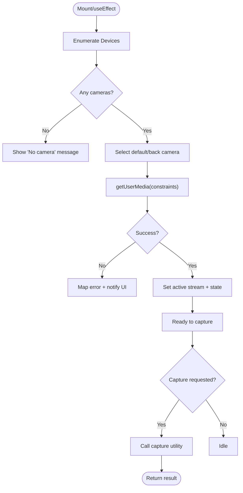
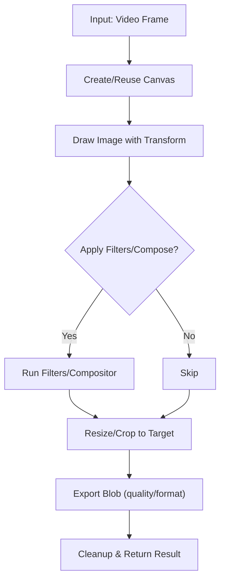
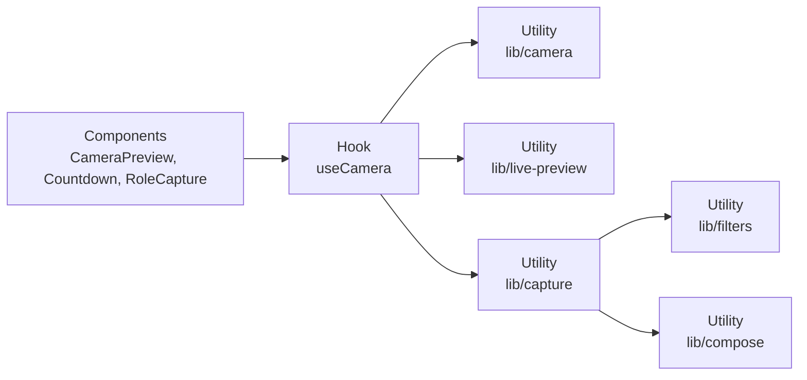

# Photobooth System

<cite>
**Referenced Files in This Document**
- [useCamera.ts](file://hooks/useCamera.ts)
- [camera.ts](file://lib/camera.ts)
- [capture.ts](file://lib/capture.ts)
- [CameraPreview.tsx](file://components/CameraPreview.tsx)
- [Countdown.tsx](file://components/Countdown.tsx)
- [RoleCapture.tsx](file://components/RoleCapture.tsx)
- [live-preview.ts](file://lib/live-preview.ts)
- [filters.ts](file://lib/filters.ts)
- [compose.ts](file://lib/compose.ts)
</cite>

## Table of Contents
1. [Introduction](#introduction)
2. [Project Structure](#project-structure)
3. [Core Components](#core-components)
4. [Architecture Overview](#architecture-overview)
5. [Detailed Component Analysis](#detailed-component-analysis)
6. [Dependency Analysis](#dependency-analysis)
7. [Performance Considerations](#performance-considerations)
8. [Troubleshooting Guide](#troubleshooting-guide)
9. [Conclusion](#conclusion)

## Introduction
This document explains the photobooth system’s camera capture functionality: how it integrates with Web APIs, manages media streams, selects devices, and orchestrates the capture workflow from preview to final image processing. It also covers countdown timing, multi-camera support for group coordination, canvas operations, image optimization, memory management, permission handling, error recovery, performance tuning, browser compatibility, mobile optimizations, and the relationships between hooks, utilities, and UI components.

## Project Structure
The camera subsystem spans three layers:
- Hooks: React integration for device enumeration, stream lifecycle, and state synchronization.
- Utilities: Low-level camera/stream control, capture helpers, filters, composition, and live preview.
- UI Components: Camera preview, countdown overlay, role-based capture flows, and strip mockups.

**Diagram sources**
- [useCamera.ts](file://hooks/useCamera.ts)
- [camera.ts](file://lib/camera.ts)
- [capture.ts](file://lib/capture.ts)
- [CameraPreview.tsx](file://components/CameraPreview.tsx)
- [Countdown.tsx](file://components/Countdown.tsx)
- [RoleCapture.tsx](file://components/RoleCapture.tsx)
- [live-preview.ts](file://lib/live-preview.ts)
- [filters.ts](file://lib/filters.ts)
- [compose.ts](file://lib/compose.ts)

**Section sources**
- [useCamera.ts](file://hooks/useCamera.ts)
- [camera.ts](file://lib/camera.ts)
- [capture.ts](file://lib/capture.ts)
- [CameraPreview.tsx](file://components/CameraPreview.tsx)
- [Countdown.tsx](file://components/Countdown.tsx)
- [RoleCapture.tsx](file://components/RoleCapture.tsx)
- [live-preview.ts](file://lib/live-preview.ts)
- [filters.ts](file://lib/filters.ts)
- [compose.ts](file://lib/compose.ts)

## Core Components
- useCamera hook: Encapsulates MediaDevices/MediaStream lifecycle, device selection, constraints, permissions, and reactive state for the active stream and selected device.
- lib/camera: Stream factory, device enumeration, constraint normalization, and safe start/stop routines.
- lib/capture: Canvas-based capture, frame extraction, orientation handling, cropping, resizing, and export helpers.
- lib/live-preview: Optimized preview rendering pipeline (e.g., offscreen or low-res path).
- lib/filters and lib/compose: Image transformations and compositing used during capture or post-processing.
- CameraPreview component: Renders the live video feed, overlays, and exposes capture triggers.
- Countdown component: Visual and audio countdown overlay coordinating capture timing.
- RoleCapture component: Orchestrates multi-role/group capture sequences.

**Section sources**
- [useCamera.ts](file://hooks/useCamera.ts)
- [camera.ts](file://lib/camera.ts)
- [capture.ts](file://lib/capture.ts)
- [live-preview.ts](file://lib/live-preview.ts)
- [filters.ts](file://lib/filters.ts)
- [compose.ts](file://lib/compose.ts)
- [CameraPreview.tsx](file://components/CameraPreview.tsx)
- [Countdown.tsx](file://components/Countdown.tsx)
- [RoleCapture.tsx](file://components/RoleCapture.tsx)

## Architecture Overview
The camera flow follows a clear separation of concerns:
- UI triggers actions (start preview, select device, capture).
- useCamera translates UI intents into stream operations and exposes state.
- lib/camera handles Web API calls and resource cleanup.
- lib/capture performs pixel-level operations via Canvas.
- Filters and compose apply transformations before saving or sharing.

**Diagram sources**
- [useCamera.ts](file://hooks/useCamera.ts)
- [camera.ts](file://lib/camera.ts)
- [capture.ts](file://lib/capture.ts)
- [CameraPreview.tsx](file://components/CameraPreview.tsx)
- [RoleCapture.tsx](file://components/RoleCapture.tsx)

## Detailed Component Analysis

### useCamera Hook
Responsibilities:
- Device enumeration and filtering (facingMode, label, capabilities).
- Permission prompts and graceful fallbacks.
- Stream creation with normalized constraints (resolution, frameRate, aspect ratio).
- Lifecycle management: start, stop, restart on device change.
- Reactive state: active stream, selected deviceId, facing mode, errors, loading.

Key behaviors:
- Debounced device changes to avoid rapid reflows.
- Safe disposal of previous MediaStream tracks to prevent leaks.
- Error mapping for common failures (NotAllowedError, NotFoundError, OverconstrainedError).
- Mobile-specific adjustments (back/front camera defaults, orientation lock hints).

**Diagram sources**
- [useCamera.ts](file://hooks/useCamera.ts)
- [camera.ts](file://lib/camera.ts)
- [capture.ts](file://lib/capture.ts)

**Section sources**
- [useCamera.ts](file://hooks/useCamera.ts)
- [camera.ts](file://lib/camera.ts)

### lib/camera: Stream Management and Device Selection
Capabilities:
- Normalize constraints across browsers (width/height vs. ideal, frameRate, facingMode).
- Enumerate devices with labels and capabilities where available.
- Create and dispose MediaStream instances safely.
- Provide helper to switch devices without full page reload.

Best practices implemented:
- Prefer stable identifiers (deviceId) over track IDs.
- Stop all tracks when switching or unmounting.
- Fallback to generic constraints if specific ones fail.

**Section sources**
- [camera.ts](file://lib/camera.ts)

### lib/capture: Canvas Operations and Image Optimization
Workflow:
- Draw current video frame onto an offscreen canvas sized to target resolution.
- Apply rotation/orientation correction using EXIF-like logic or transform matrices.
- Optional crop/resize to fit desired output dimensions.
- Export to Blob (JPEG/PNG/WebP) with quality settings.
- Return structured result including dimensions, format, size, and base64/Blob.

Optimizations:
- Reuse canvas instances to reduce allocation overhead.
- Downscale large frames for previews; upscale only for final export.
- Use appropriate MIME types and quality for balance between size and fidelity.

Memory management:
- Clear intermediate buffers after export.
- Avoid holding large ImageData longer than necessary.
- Ensure canvas contexts are released when no longer needed.

**Diagram sources**
- [capture.ts](file://lib/capture.ts)
- [filters.ts](file://lib/filters.ts)
- [compose.ts](file://lib/compose.ts)

**Section sources**
- [capture.ts](file://lib/capture.ts)
- [filters.ts](file://lib/filters.ts)
- [compose.ts](file://lib/compose.ts)

### CameraPreview Component
- Renders <video> element bound to the stream from useCamera.
- Displays overlays (countdown, filters, stickers).
- Exposes methods to trigger capture and handle results.
- Adapts layout for portrait/landscape and mobile screens.

Integration points:
- Subscribes to stream changes and updates srcObject.
- Listens for capture events and forwards to useCamera.
- Shows error banners for permission or device issues.

**Section sources**
- [CameraPreview.tsx](file://components/CameraPreview.tsx)
- [useCamera.ts](file://hooks/useCamera.ts)

### Countdown Component
- Provides visual countdown overlay and optional audio cues.
- Coordinates with capture to ensure consistent timing.
- Supports custom durations and callbacks on completion.

Interaction:
- Controlled by parent (CameraPreview/RoleCapture) via props/state.
- Emits “ready” event to trigger actual capture.

**Section sources**
- [Countdown.tsx](file://components/Countdown.tsx)
- [CameraPreview.tsx](file://components/CameraPreview.tsx)

### RoleCapture Component (Multi-Camera Group Coordination)
- Manages multiple roles/cameras (e.g., front/back, external USB).
- Sequences captures per role with countdown and transitions.
- Aggregates results into a strip or collage.

Flow:
- Initialize role list and per-role states.
- For each role: start preview, run countdown, capture, advance.
- On completion, compose outputs and present/share.

**Section sources**
- [RoleCapture.tsx](file://components/RoleCapture.tsx)
- [useCamera.ts](file://hooks/useCamera.ts)
- [capture.ts](file://lib/capture.ts)

### Live Preview Pipeline
- Uses optimized rendering path (e.g., lower resolution or offscreen canvas) to maintain smooth playback.
- Decouples preview resolution from capture resolution.
- Handles orientation changes and viewport resizes efficiently.

**Section sources**
- [live-preview.ts](file://lib/live-preview.ts)
- [useCamera.ts](file://hooks/useCamera.ts)

## Dependency Analysis
High-level dependencies:
- UI components depend on useCamera for stream and state.
- useCamera depends on lib/camera for Web API access.
- Capture depends on lib/capture, lib/filters, and lib/compose.
- Live preview may share canvas resources with capture to minimize allocations.

**Diagram sources**
- [CameraPreview.tsx](file://components/CameraPreview.tsx)
- [Countdown.tsx](file://components/Countdown.tsx)
- [RoleCapture.tsx](file://components/RoleCapture.tsx)
- [useCamera.ts](file://hooks/useCamera.ts)
- [camera.ts](file://lib/camera.ts)
- [live-preview.ts](file://lib/live-preview.ts)
- [capture.ts](file://lib/capture.ts)
- [filters.ts](file://lib/filters.ts)
- [compose.ts](file://lib/compose.ts)

**Section sources**
- [useCamera.ts](file://hooks/useCamera.ts)
- [camera.ts](file://lib/camera.ts)
- [capture.ts](file://lib/capture.ts)
- [filters.ts](file://lib/filters.ts)
- [compose.ts](file://lib/compose.ts)
- [CameraPreview.tsx](file://components/CameraPreview.tsx)
- [Countdown.tsx](file://components/Countdown.tsx)
- [RoleCapture.tsx](file://components/RoleCapture.tsx)
- [live-preview.ts](file://lib/live-preview.ts)

## Performance Considerations
- Resolution scaling: Render preview at a lower resolution; capture at target resolution.
- Canvas reuse: Maintain a single canvas instance per operation type to avoid GC pressure.
- Quality tuning: Choose JPEG/WebP quality that balances size and clarity; prefer WebP when supported.
- Track disposal: Always stop tracks when switching devices or unmounting to free bandwidth and CPU.
- Offscreen rendering: Use offscreen canvases for heavy transforms to keep UI responsive.
- Throttling: Debounce device enumeration and resize handlers.
- Memory hygiene: Null references to large objects after export; avoid retaining ImageData beyond necessity.

[No sources needed since this section provides general guidance]

## Troubleshooting Guide
Common issues and resolutions:
- Permission denied: Prompt user explicitly; provide instructions to enable camera access. Retry after consent.
- No camera found: Fall back to generic constraints; inform user if none available.
- OverconstrainedError: Relax width/height/frameRate constraints and retry.
- Black screen or frozen preview: Restart stream; check for orientation or autoplay policies.
- Slow capture: Reduce canvas size, skip heavy filters, or defer non-critical work.
- Memory spikes: Ensure proper cleanup of canvases, blobs, and tracks; avoid long-lived references.

Recovery strategies:
- Wrap getUserMedia and canvas operations in try/catch with user-friendly messages.
- Implement automatic retries with exponential backoff for transient errors.
- Provide manual “Retry” controls for failed steps.

**Section sources**
- [useCamera.ts](file://hooks/useCamera.ts)
- [camera.ts](file://lib/camera.ts)
- [capture.ts](file://lib/capture.ts)

## Conclusion
The photobooth system cleanly separates UI, hook orchestration, and low-level utilities to deliver robust camera capture. By leveraging Web APIs through a dedicated hook and utilities, it supports device selection, stream lifecycle management, countdown-driven capture, and multi-camera workflows. Canvas-based processing enables flexible image optimization and composition while maintaining performance and memory efficiency. With careful error handling and mobile considerations, the system provides a reliable experience across browsers and devices.