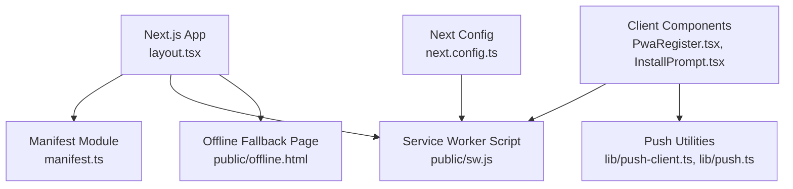
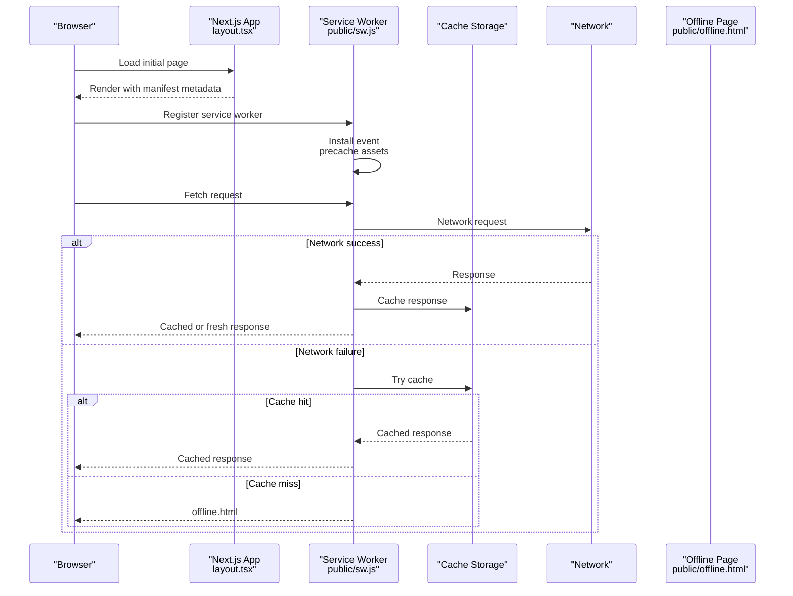
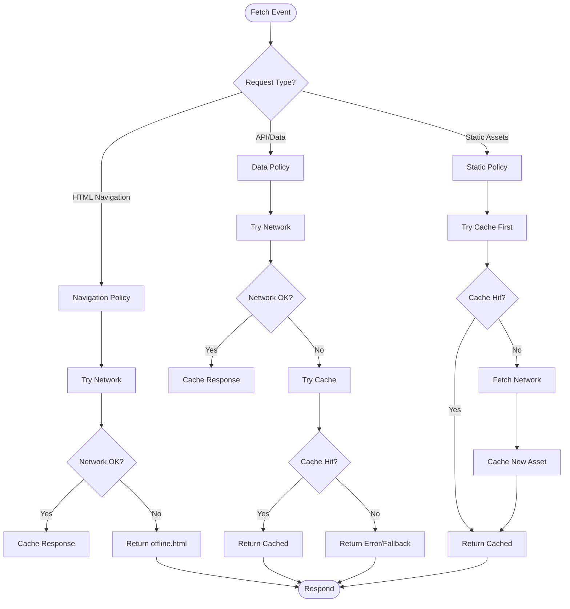
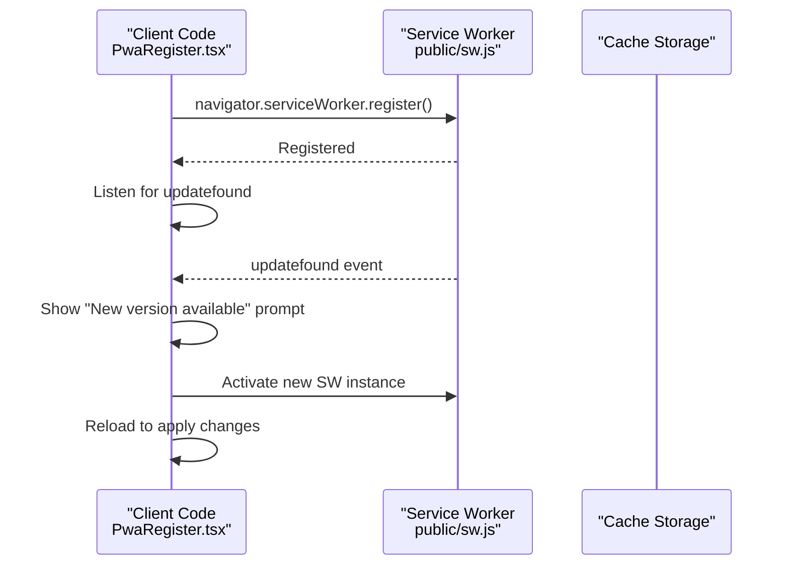
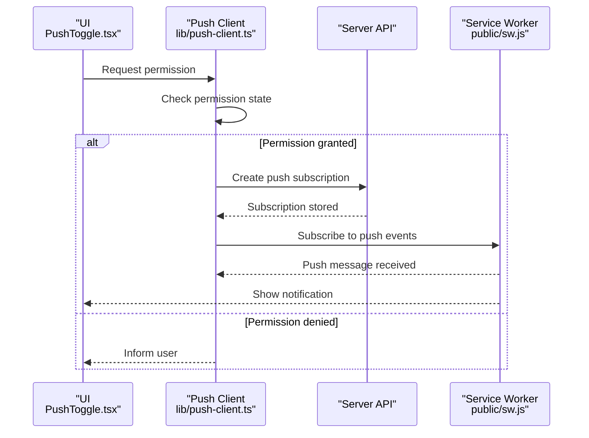
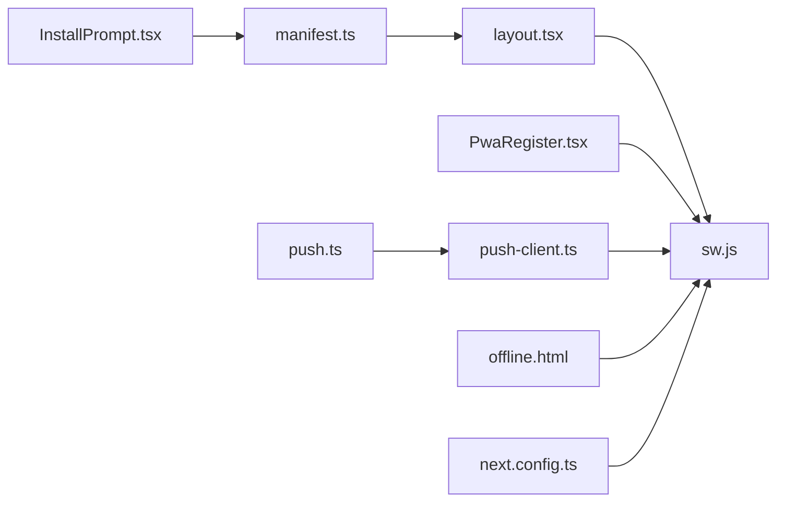

# Progressive Web App

<cite>
**Referenced Files in This Document**
- [manifest.ts](file://app/manifest.ts)
- [sw.js](file://public/sw.js)
- [offline.html](file://public/offline.html)
- [PwaRegister.tsx](file://components/PwaRegister.tsx)
- [InstallPrompt.tsx](file://components/InstallPrompt.tsx)
- [push-client.ts](file://lib/push-client.ts)
- [push.ts](file://lib/push.ts)
- [next.config.ts](file://next.config.ts)
- [layout.tsx](file://app/layout.tsx)
</cite>

## Table of Contents
1. [Introduction](#introduction)
2. [Project Structure](#project-structure)
3. [Core Components](#core-components)
4. [Architecture Overview](#architecture-overview)
5. [Detailed Component Analysis](#detailed-component-analysis)
6. [Dependency Analysis](#dependency-analysis)
7. [Performance Considerations](#performance-considerations)
8. [Troubleshooting Guide](#troubleshooting-guide)
9. [Conclusion](#conclusion)
10. [Appendices](#appendices)

## Introduction
This document explains the Progressive Web App implementation in the project, focusing on service worker configuration for caching strategies, background sync, and offline functionality; web app manifest settings including icons, themes, and display modes; offline HTML fallback; network-first caching policies; PWA registration and update detection; cache management; install prompts and add-to-home-screen behavior; performance optimizations such as asset preloading, lazy loading, and bundle splitting; and debugging/testing techniques using browser developer tools.

## Project Structure
The PWA-related assets and logic are organized across the following areas:
- Application manifest definition is centralized in a TypeScript module that exports the manifest configuration consumed by Next.js.
- The service worker script resides under public and handles runtime caching and offline responses.
- An offline HTML page provides a user-friendly fallback when the network is unavailable.
- Client-side components manage PWA registration, update detection, and install prompts.
- Push notification utilities coordinate permission handling and message routing.
- Next.js configuration may include service worker integration or related settings.
- The root layout wires up the manifest and other global PWA metadata.

**Diagram sources**
- [layout.tsx](file://app/layout.tsx)
- [manifest.ts](file://app/manifest.ts)
- [sw.js](file://public/sw.js)
- [offline.html](file://public/offline.html)
- [PwaRegister.tsx](file://components/PwaRegister.tsx)
- [InstallPrompt.tsx](file://components/InstallPrompt.tsx)
- [push-client.ts](file://lib/push-client.ts)
- [push.ts](file://lib/push.ts)
- [next.config.ts](file://next.config.ts)

**Section sources**
- [layout.tsx](file://app/layout.tsx)
- [manifest.ts](file://app/manifest.ts)
- [sw.js](file://public/sw.js)
- [offline.html](file://public/offline.html)
- [PwaRegister.tsx](file://components/PwaRegister.tsx)
- [InstallPrompt.tsx](file://components/InstallPrompt.tsx)
- [push-client.ts](file://lib/push-client.ts)
- [push.ts](file://lib/push.ts)
- [next.config.ts](file://next.config.ts)

## Core Components
- Manifest module: Defines app name, short name, description, start URL, display mode, theme color, background color, and icon set used by browsers to render install prompts and home screen entries.
- Service worker script: Registers fetch and navigation handlers to implement caching strategies (e.g., network-first with cache fallback), background sync tasks, and offline responses.
- Offline HTML fallback: A lightweight page served when requests cannot be fulfilled from the network or cache.
- PWA registration component: Registers the service worker, listens for updates, and triggers UI prompts when new versions are available.
- Install prompt component: Interacts with the beforeinstallprompt event to present an install button and handle user choices.
- Push utilities: Manage push subscription creation, permission prompts, and message handling for notifications.

**Section sources**
- [manifest.ts](file://app/manifest.ts)
- [sw.js](file://public/sw.js)
- [offline.html](file://public/offline.html)
- [PwaRegister.tsx](file://components/PwaRegister.tsx)
- [InstallPrompt.tsx](file://components/InstallPrompt.tsx)
- [push-client.ts](file://lib/push-client.ts)
- [push.ts](file://lib/push.ts)

## Architecture Overview
At runtime, the browser loads the Next.js application which includes the manifest metadata and registers the service worker. The service worker intercepts network requests and applies caching policies. When offline, the offline HTML page is shown. Install prompts are triggered via the manifest and client-side events. Push notifications are handled through dedicated utilities.

**Diagram sources**
- [layout.tsx](file://app/layout.tsx)
- [sw.js](file://public/sw.js)
- [offline.html](file://public/offline.html)

## Detailed Component Analysis

### Web App Manifest Configuration
The manifest defines how the app appears when installed and launched from the home screen. It typically includes:
- App identity: name, short_name, description
- Launch behavior: start_url, display, orientation
- Visual styling: theme_color, background_color
- Icons: multiple resolutions for various device densities
- Scope and related settings controlling installation and navigation boundaries

Best practices:
- Provide icons at common sizes (e.g., 192, 512) and ensure transparency where needed.
- Set display to standalone or minimal-ui for app-like experiences.
- Use a consistent theme color matching your brand.

**Section sources**
- [manifest.ts](file://app/manifest.ts)

### Service Worker: Caching Strategies and Offline Functionality
The service worker implements:
- Precaching during install to store critical shell assets.
- Runtime caching strategies for different resource types:
  - Network-first with cache fallback for dynamic content.
  - Cache-first for static assets like images and fonts.
- Background sync to defer actions until connectivity is restored.
- Offline fallback to serve offline.html when resources are unavailable.

Key responsibilities:
- Intercept fetch events and decide strategy based on request type.
- Manage cache namespaces and versioning to avoid stale data.
- Handle push and notification events if applicable.

**Diagram sources**
- [sw.js](file://public/sw.js)

**Section sources**
- [sw.js](file://public/sw.js)

### Offline HTML Fallback
The offline page should:
- Clearly communicate that the app is offline.
- Provide basic instructions or links to retry.
- Be small and self-contained to ensure it loads without network dependencies.

Implementation notes:
- Serve this file from the service worker when both network and cache fail.
- Avoid heavy assets; keep it minimal for fast rendering.

**Section sources**
- [offline.html](file://public/offline.html)

### PWA Registration and Update Detection
Registration involves:
- Detecting service worker support.
- Registering the service worker script.
- Listening for update events to notify users of new versions.
- Optionally prompting users to refresh to apply updates.

Update detection flow:
- On load, register the service worker.
- Listen for controllerchange or updatefound events.
- Prompt the user to reload when a new version is available.

**Diagram sources**
- [PwaRegister.tsx](file://components/PwaRegister.tsx)
- [sw.js](file://public/sw.js)

**Section sources**
- [PwaRegister.tsx](file://components/PwaRegister.tsx)

### Install Prompts and Add-to-Home-Screen
Install prompts rely on:
- A valid manifest with required fields and icons.
- Serving over HTTPS.
- Handling the beforeinstallprompt event to show a custom install button.
- Storing user choice to avoid repeated prompts.

Behavioral considerations:
- Some platforms require user interaction before showing the install prompt.
- Respect user preferences and provide a way to re-prompt if appropriate.

**Section sources**
- [InstallPrompt.tsx](file://components/InstallPrompt.tsx)
- [manifest.ts](file://app/manifest.ts)

### Push Notifications Integration
Push functionality includes:
- Requesting notification permissions.
- Creating a push subscription and sending it to the server.
- Handling incoming push messages and displaying notifications.
- Optional background sync to queue actions when offline.

**Diagram sources**
- [push-client.ts](file://lib/push-client.ts)
- [push.ts](file://lib/push.ts)
- [sw.js](file://public/sw.js)

**Section sources**
- [push-client.ts](file://lib/push-client.ts)
- [push.ts](file://lib/push.ts)

### Next.js Integration Points
- The layout file typically injects the manifest link and other meta tags.
- The Next.js config may include service worker setup or related options.

Ensure:
- The manifest path matches what the browser expects.
- The service worker is discoverable at the expected URL.

**Section sources**
- [layout.tsx](file://app/layout.tsx)
- [next.config.ts](file://next.config.ts)

## Dependency Analysis
The PWA features depend on coordinated interactions between the manifest, service worker, client components, and push utilities. Misconfiguration in any area can break installation, caching, or notifications.

**Diagram sources**
- [manifest.ts](file://app/manifest.ts)
- [layout.tsx](file://app/layout.tsx)
- [sw.js](file://public/sw.js)
- [PwaRegister.tsx](file://components/PwaRegister.tsx)
- [InstallPrompt.tsx](file://components/InstallPrompt.tsx)
- [push-client.ts](file://lib/push-client.ts)
- [push.ts](file://lib/push.ts)
- [offline.html](file://public/offline.html)
- [next.config.ts](file://next.config.ts)

**Section sources**
- [manifest.ts](file://app/manifest.ts)
- [layout.tsx](file://app/layout.tsx)
- [sw.js](file://public/sw.js)
- [PwaRegister.tsx](file://components/PwaRegister.tsx)
- [InstallPrompt.tsx](file://components/InstallPrompt.tsx)
- [push-client.ts](file://lib/push-client.ts)
- [push.ts](file://lib/push.ts)
- [offline.html](file://public/offline.html)
- [next.config.ts](file://next.config.ts)

## Performance Considerations
- Asset preloading: Use preload hints for critical resources to reduce time-to-first-byte.
- Lazy loading: Defer non-critical assets and code chunks to improve initial load.
- Bundle splitting: Ensure route-based code splitting to minimize payload size.
- Cache strategies: Prefer cache-first for static assets and network-first for dynamic data.
- Image optimization: Serve appropriately sized images and use modern formats.
- Service worker precache: Include essential shell assets to enable instant cold starts.

[No sources needed since this section provides general guidance]

## Troubleshooting Guide
Common issues and remedies:
- Service worker not registering:
  - Verify HTTPS and correct script path.
  - Check console for registration errors.
- Install prompt not appearing:
  - Ensure manifest meets requirements and is linked correctly.
  - Confirm the app has been interacted with by the user.
- Offline page not showing:
  - Validate fetch handler fallback logic in the service worker.
  - Ensure offline.html is cached or accessible.
- Push notifications failing:
  - Confirm permission state and subscription creation.
  - Inspect push event listeners in the service worker.
- Updates not applied:
  - Trigger reload after detecting updatefound.
  - Clear caches and reinstall the service worker if necessary.

Debugging tips:
- Use the Application tab to inspect service workers, caches, and storage.
- Use the Network tab to simulate offline scenarios and throttling.
- Use the Console to log service worker lifecycle events and errors.

**Section sources**
- [sw.js](file://public/sw.js)
- [PwaRegister.tsx](file://components/PwaRegister.tsx)
- [InstallPrompt.tsx](file://components/InstallPrompt.tsx)
- [push-client.ts](file://lib/push-client.ts)
- [push.ts](file://lib/push.ts)
- [offline.html](file://public/offline.html)

## Conclusion
This PWA implementation integrates a robust service worker with strategic caching, offline fallbacks, and push notifications. The manifest and client components enable seamless installation and updates. By following best practices for performance and debugging, the app delivers a reliable, app-like experience across devices and network conditions.

[No sources needed since this section summarizes without analyzing specific files]

## Appendices
- Practical examples:
  - PWA registration: See the client-side registration logic and update detection flow.
  - Cache management: Review the service worker’s cache namespace and versioning strategy.
  - Install prompts: Examine the beforeinstallprompt handling and user preference storage.
  - Offline fallback: Confirm the offline.html structure and service worker fallback logic.
  - Push notifications: Follow the permission and subscription workflow.

[No sources needed since this section provides general guidance]