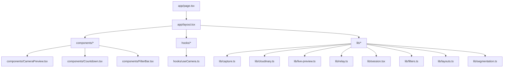
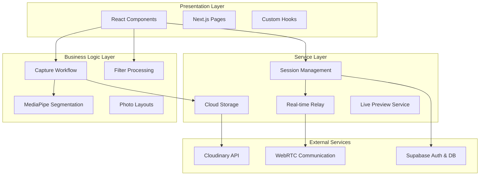
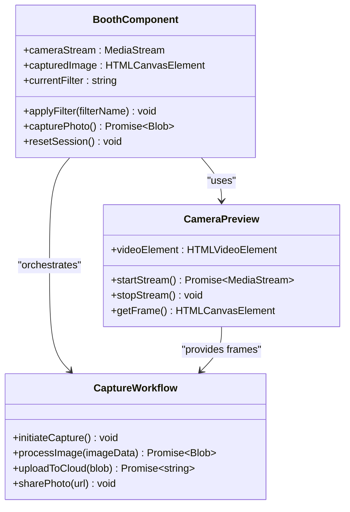
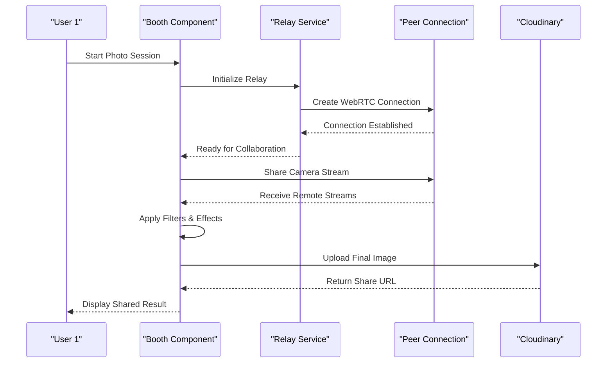
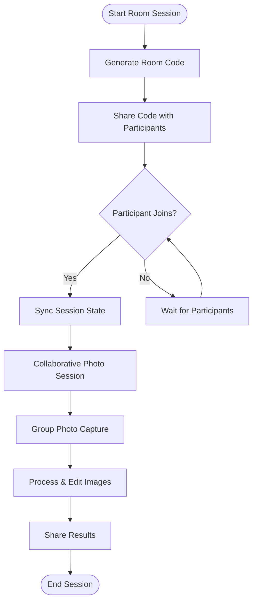
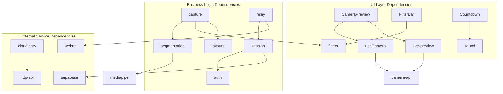

# Project Overview

<cite>
**Referenced Files in This Document**
- [README.md](file://README.md)
- [package.json](file://package.json)
- [next.config.ts](file://next.config.ts)
- [app/page.tsx](file://app/page.tsx)
- [app/layout.tsx](file://app/layout.tsx)
- [app/booth/page.tsx](file://app/booth/page.tsx)
- [app/relay/new/page.tsx](file://app/relay/new/page.tsx)
- [app/relay/[id]/page.tsx](file://app/relay/[id]/page.tsx)
- [app/room/[code]/page.tsx](file://app/room/[code]/page.tsx)
- [components/CameraPreview.tsx](file://components/CameraPreview.tsx)
- [components/Countdown.tsx](file://components/Countdown.tsx)
- [components/FilterBar.tsx](file://components/FilterBar.tsx)
- [hooks/useCamera.ts](file://hooks/useCamera.ts)
- [lib/capture.ts](file://lib/capture.ts)
- [lib/cloudinary.ts](file://lib/cloudinary.ts)
- [lib/live-preview.ts](file://lib/live-preview.ts)
- [lib/relay.ts](file://lib/relay.ts)
- [lib/session.tsx](file://lib/session.tsx)
- [lib/scenes.ts](file://lib/scenes.ts)
- [lib/filters.ts](file://lib/filters.ts)
- [lib/layouts.ts](file://lib/layouts.ts)
- [lib/segmentation.ts](file://lib/segmentation.ts)
- [public/sw.js](file://public/sw.js)
</cite>

## Table of Contents
1. [Introduction](#introduction)
2. [Project Structure](#project-structure)
3. [Core Components](#core-components)
4. [Architecture Overview](#architecture-overview)
5. [Detailed Component Analysis](#detailed-component-analysis)
6. [Dependency Analysis](#dependency-analysis)
7. [Performance Considerations](#performance-considerations)
8. [Troubleshooting Guide](#troubleshooting-guide)
9. [Conclusion](#conclusion)

## Introduction
Zuychin Photobooth is a modern, web-based photobooth application designed to deliver an engaging, real-time photo capture experience with advanced editing and cloud integration. It enables users to create fun photo strips, apply filters and stickers, collaborate in real time, and share results instantly. The app supports both single-user sessions and multi-user collaboration through room sessions and relay flows, making it suitable for events, parties, or everyday use.

Key features:
- Real-time collaboration via WebRTC-powered relay and room sessions
- Advanced photo editing with filters, layouts, and segmentation effects
- Cloud integration for storage and sharing using Cloudinary
- Progressive Web App (PWA) support for offline-friendly experiences
- Streamlined capture workflow from landing page to final photo sharing

The technology stack includes Next.js for the full-stack framework, Supabase for authentication and data services, Cloudinary for media handling, WebRTC for real-time communication, and MediaPipe for on-device segmentation and effects.

## Project Structure
The project follows a Next.js App Router structure with feature-oriented directories:
- app/: Routes and pages for booth, relay, room sessions, timeline, and more
- components/: Reusable UI components such as camera preview, countdown, filter bar
- hooks/: Custom React hooks like useCamera for camera access
- lib/: Core logic modules including capture, cloud upload, live preview, relay, session management, filters, layouts, and segmentation
- public/: Static assets including PWA service worker and MediaPipe WASM files

**Diagram sources**
- [app/page.tsx](file://app/page.tsx)
- [app/layout.tsx](file://app/layout.tsx)
- [components/CameraPreview.tsx](file://components/CameraPreview.tsx)
- [components/Countdown.tsx](file://components/Countdown.tsx)
- [components/FilterBar.tsx](file://components/FilterBar.tsx)
- [hooks/useCamera.ts](file://hooks/useCamera.ts)
- [lib/capture.ts](file://lib/capture.ts)
- [lib/cloudinary.ts](file://lib/cloudinary.ts)
- [lib/live-preview.ts](file://lib/live-preview.ts)
- [lib/relay.ts](file://lib/relay.ts)
- [lib/session.tsx](file://lib/session.tsx)
- [lib/filters.ts](file://lib/filters.ts)
- [lib/layouts.ts](file://lib/layouts.ts)
- [lib/segmentation.ts](file://lib/segmentation.ts)

**Section sources**
- [README.md](file://README.md)
- [package.json](file://package.json)
- [next.config.ts](file://next.config.ts)

## Core Components
The application is built around several core components that handle user interactions, media processing, and state management:

- CameraPreview: Renders live camera feed and handles video stream management
- Countdown: Provides visual countdown timers for photo capture
- FilterBar: Allows users to select and apply various photo filters
- useCamera hook: Manages camera permissions and stream lifecycle
- Capture workflow: Orchestrates the sequence from preview to final image capture
- Relay system: Enables real-time collaboration between multiple users
- Room sessions: Facilitates group photo sessions with shared state

These components work together to create a seamless photobooth experience, with clear separation between UI components, business logic, and service layers.

**Section sources**
- [components/CameraPreview.tsx](file://components/CameraPreview.tsx)
- [components/Countdown.tsx](file://components/Countdown.tsx)
- [components/FilterBar.tsx](file://components/FilterBar.tsx)
- [hooks/useCamera.ts](file://hooks/useCamera.ts)
- [lib/capture.ts](file://lib/capture.ts)

## Architecture Overview
The Zuychin Photobooth follows a layered architecture pattern with clear separation of concerns:

**Diagram sources**
- [lib/capture.ts](file://lib/capture.ts)
- [lib/filters.ts](file://lib/filters.ts)
- [lib/segmentation.ts](file://lib/segmentation.ts)
- [lib/layouts.ts](file://lib/layouts.ts)
- [lib/session.tsx](file://lib/session.tsx)
- [lib/relay.ts](file://lib/relay.ts)
- [lib/cloudinary.ts](file://lib/cloudinary.ts)
- [lib/live-preview.ts](file://lib/live-preview.ts)

The architecture emphasizes modularity and testability, with each layer having specific responsibilities and well-defined interfaces for communication between components.

## Detailed Component Analysis

### Booth Component Analysis
The booth component serves as the main photobooth interface, providing the primary user interaction point for photo capture and editing.

**Diagram sources**
- [app/booth/page.tsx](file://app/booth/page.tsx)
- [components/CameraPreview.tsx](file://components/CameraPreview.tsx)
- [lib/capture.ts](file://lib/capture.ts)

### Relay System Analysis
The relay system enables real-time collaboration between multiple users, allowing them to share camera feeds and coordinate photo sessions.

**Diagram sources**
- [lib/relay.ts](file://lib/relay.ts)
- [app/relay/new/page.tsx](file://app/relay/new/page.tsx)
- [app/relay/[id]/page.tsx](file://app/relay/[id]/page.tsx)

### Room Sessions Analysis
Room sessions facilitate group photo activities where multiple participants can join a shared session code.

**Diagram sources**
- [app/room/[code]/page.tsx](file://app/room/[code]/page.tsx)
- [lib/session.tsx](file://lib/session.tsx)

**Section sources**
- [app/booth/page.tsx](file://app/booth/page.tsx)
- [lib/relay.ts](file://lib/relay.ts)
- [lib/session.tsx](file://lib/session.tsx)

## Dependency Analysis
The application has a well-structured dependency hierarchy with clear separation between presentation, business logic, and external services.

**Diagram sources**
- [components/CameraPreview.tsx](file://components/CameraPreview.tsx)
- [hooks/useCamera.ts](file://hooks/useCamera.ts)
- [lib/live-preview.ts](file://lib/live-preview.ts)
- [lib/filters.ts](file://lib/filters.ts)
- [lib/capture.ts](file://lib/capture.ts)
- [lib/segmentation.ts](file://lib/segmentation.ts)
- [lib/relay.ts](file://lib/relay.ts)
- [lib/session.tsx](file://lib/session.tsx)
- [lib/cloudinary.ts](file://lib/cloudinary.ts)

The dependency structure ensures loose coupling between components while maintaining clear communication patterns through well-defined interfaces and service contracts.

**Section sources**
- [package.json](file://package.json)
- [next.config.ts](file://next.config.ts)

## Performance Considerations
The application implements several performance optimization strategies:

- **Lazy Loading**: Components and libraries are loaded on-demand to reduce initial bundle size
- **Streaming Media**: Camera streams are managed efficiently with proper resource cleanup
- **Client-side Processing**: Image filtering and effects are processed locally when possible
- **Caching Strategies**: Frequently used assets and configurations are cached appropriately
- **Progressive Enhancement**: Core functionality works without JavaScript for basic features
- **Memory Management**: Proper cleanup of camera streams and canvas operations prevents memory leaks

The PWA implementation provides offline capabilities and improved loading performance through service worker caching strategies.

## Troubleshooting Guide
Common issues and their solutions:

**Camera Access Problems:**
- Ensure HTTPS is enabled for camera access
- Check browser permissions for camera and microphone
- Verify device compatibility with WebRTC APIs

**Real-time Collaboration Issues:**
- Validate WebRTC connection establishment
- Check firewall settings for peer-to-peer communication
- Monitor network connectivity and bandwidth limitations

**Image Processing Errors:**
- Verify MediaPipe model loading and initialization
- Check canvas dimensions and image format compatibility
- Monitor memory usage during heavy image operations

**Cloud Upload Failures:**
- Validate Cloudinary credentials and configuration
- Check network connectivity and API rate limits
- Implement retry mechanisms for failed uploads

**Section sources**
- [public/sw.js](file://public/sw.js)
- [lib/capture.ts](file://lib/capture.ts)
- [lib/cloudinary.ts](file://lib/cloudinary.ts)

## Conclusion
Zuychin Photobooth represents a comprehensive solution for modern web-based photobooth applications. Its architecture balances ease of use for beginners with powerful features for experienced developers. The modular design allows for easy customization and extension, while the robust feature set supports both casual and professional use cases.

The application successfully combines cutting-edge web technologies with intuitive user interfaces to deliver a seamless photobooth experience. Future enhancements could include additional filter types, advanced editing tools, and expanded social sharing capabilities.