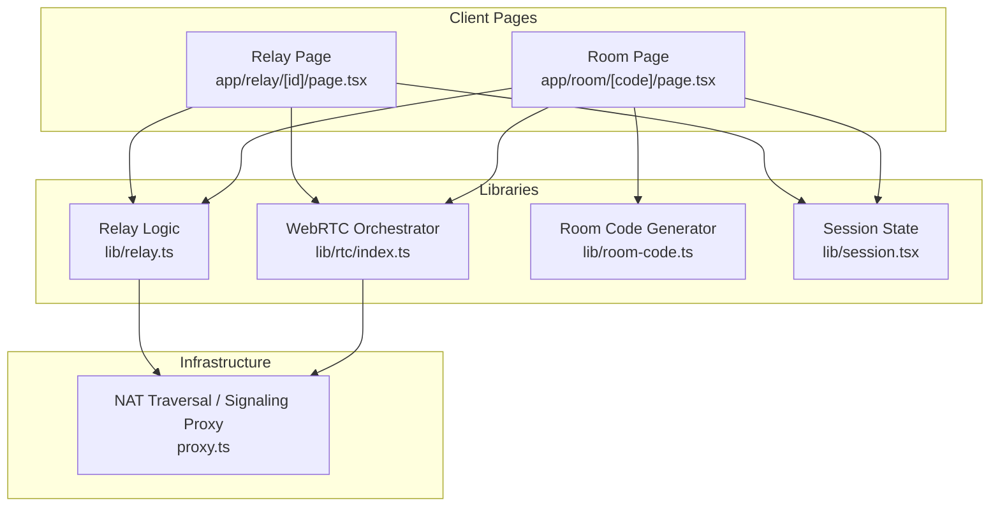
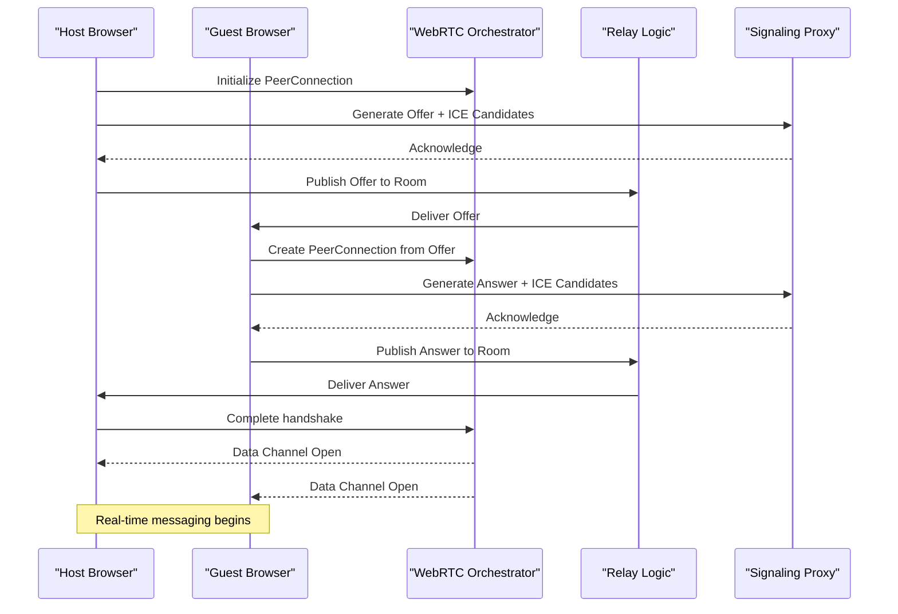
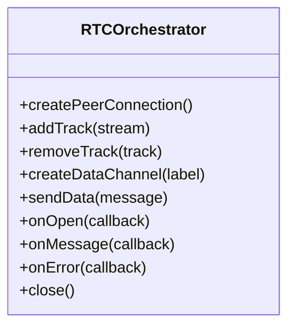
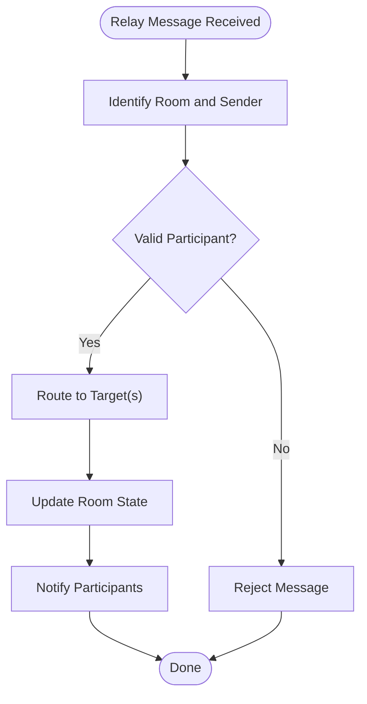
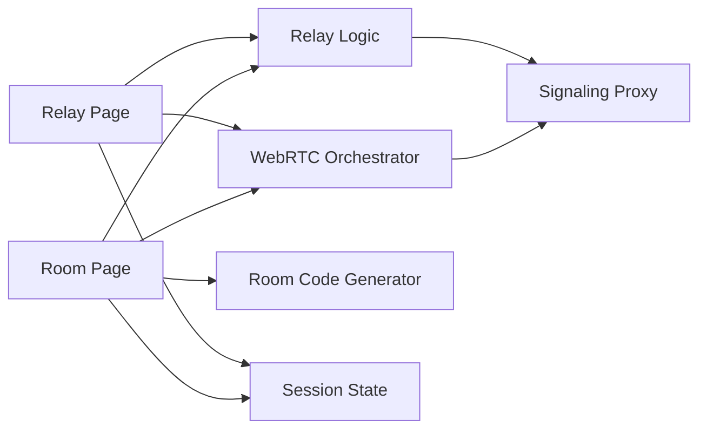

# Real-time Collaboration

<cite>
**Referenced Files in This Document**
- [app/room/[code]/page.tsx](file://app/room/%5Bcode%5D/page.tsx)
- [app/relay/[id]/page.tsx](file://app/relay/%5Bid%5D/page.tsx)
- [lib/rtc/index.ts](file://lib/rtc/index.ts)
- [lib/relay.ts](file://lib/relay.ts)
- [lib/room-code.ts](file://lib/room-code.ts)
- [lib/session.tsx](file://lib/session.tsx)
- [proxy.ts](file://proxy.ts)
</cite>

## Table of Contents
1. [Introduction](#introduction)
2. [Project Structure](#project-structure)
3. [Core Components](#core-components)
4. [Architecture Overview](#architecture-overview)
5. [Detailed Component Analysis](#detailed-component-analysis)
6. [Dependency Analysis](#dependency-analysis)
7. [Performance Considerations](#performance-considerations)
8. [Troubleshooting Guide](#troubleshooting-guide)
9. [Conclusion](#conclusion)

## Introduction
This document explains the real-time collaboration system implemented in the project, focusing on WebRTC-based peer-to-peer communication and room-based sessions. It covers how rooms are created and joined, how participants connect and synchronize state, and how a relay layer manages multiple concurrent connections. It also details connection establishment, data channel usage, error handling, scalability considerations, connection quality monitoring, and fallback mechanisms. Practical examples include generating room codes, managing participants, and updating shared state in real time.

## Project Structure
The real-time collaboration features are primarily implemented across:
- Room pages that orchestrate WebRTC signaling and participant lifecycle
- Relay pages that host or proxy connections for multi-party scenarios
- Shared libraries for WebRTC orchestration, relay logic, room code generation, and session management
- A proxy module to assist with NAT traversal and signaling when needed

**Diagram sources**
- [app/room/[code]/page.tsx](file://app/room/%5Bcode%5D/page.tsx)
- [app/relay/[id]/page.tsx](file://app/relay/%5Bid%5D/page.tsx)
- [lib/rtc/index.ts](file://lib/rtc/index.ts)
- [lib/relay.ts](file://lib/relay.ts)
- [lib/room-code.ts](file://lib/room-code.ts)
- [lib/session.tsx](file://lib/session.tsx)
- [proxy.ts](file://proxy.ts)

**Section sources**
- [app/room/[code]/page.tsx](file://app/room/%5Bcode%5D/page.tsx)
- [app/relay/[id]/page.tsx](file://app/relay/%5Bid%5D/page.tsx)
- [lib/rtc/index.ts](file://lib/rtc/index.ts)
- [lib/relay.ts](file://lib/relay.ts)
- [lib/room-code.ts](file://lib/room-code.ts)
- [lib/session.tsx](file://lib/session.tsx)
- [proxy.ts](file://proxy.ts)

## Core Components
- WebRTC Orchestrator (lib/rtc/index.ts): Encapsulates PeerConnection creation, ICE configuration, offer/answer exchange, and data channel setup. Provides APIs to create peers, add tracks, send/receive messages, and monitor connection states.
- Relay Logic (lib/relay.ts): Manages multi-party relay behavior, including routing messages between peers, maintaining participant lists, and coordinating room-level state.
- Room Code Generator (lib/room-code.ts): Produces short, collision-resistant room identifiers used to join specific collaboration sessions.
- Session Management (lib/session.tsx): Holds per-user session state, participant metadata, and shared application state synchronized via WebRTC data channels or relay.
- Proxy (proxy.ts): Assists with signaling and NAT traversal by relaying SDP and ICE candidates when direct connectivity is not possible.

Key responsibilities:
- Connection establishment: Create PeerConnections, gather ICE candidates, exchange offers/answers, and open data channels.
- Data channel communication: Send typed messages and binary payloads for real-time updates.
- Error handling: Detect and recover from network failures, ICE restarts, and channel closures.
- Scalability: Use relay architecture to fan out connections and manage concurrency.

**Section sources**
- [lib/rtc/index.ts](file://lib/rtc/index.ts)
- [lib/relay.ts](file://lib/relay.ts)
- [lib/room-code.ts](file://lib/room-code.ts)
- [lib/session.tsx](file://lib/session.tsx)
- [proxy.ts](file://proxy.ts)

## Architecture Overview
The collaboration system uses a hybrid approach:
- Direct peer-to-peer links where possible for low latency and bandwidth efficiency
- A relay layer to coordinate signaling and route traffic when direct connections fail or when scaling beyond simple mesh topologies

**Diagram sources**
- [lib/rtc/index.ts](file://lib/rtc/index.ts)
- [lib/relay.ts](file://lib/relay.ts)
- [proxy.ts](file://proxy.ts)
- [app/room/[code]/page.tsx](file://app/room/%5Bcode%5D/page.tsx)
- [app/relay/[id]/page.tsx](file://app/relay/%5Bid%5D/page.tsx)

## Detailed Component Analysis

### WebRTC Orchestrator (lib/rtc/index.ts)
Responsibilities:
- Manage one or more PeerConnections per participant
- Configure ICE servers and STUN/TURN settings
- Handle offer/answer exchange and ICE candidate trickle
- Create and manage data channels for message passing
- Emit events for connection state changes and errors

Implementation patterns:
- Factory functions to create isolated PeerConnection instances
- Event-driven API for lifecycle hooks (onopen, onmessage, onerror)
- Robust error handling for network interruptions and renegotiation

**Diagram sources**
- [lib/rtc/index.ts](file://lib/rtc/index.ts)

**Section sources**
- [lib/rtc/index.ts](file://lib/rtc/index.ts)

### Relay Logic (lib/relay.ts)
Responsibilities:
- Maintain a list of active participants per room
- Route signaling messages (offers, answers, ICE candidates) between peers
- Coordinate room-level state synchronization
- Provide health checks and reconnection strategies

Implementation patterns:
- Centralized message bus for room events
- Participant registry with metadata and connection status
- Fallback routing through proxy when direct connections fail

**Diagram sources**
- [lib/relay.ts](file://lib/relay.ts)

**Section sources**
- [lib/relay.ts](file://lib/relay.ts)

### Room Code Generator (lib/room-code.ts)
Responsibilities:
- Generate short, human-friendly room codes
- Ensure uniqueness and minimal collision probability
- Optionally encode metadata (e.g., expiration, capacity)

Usage example:
- When creating a new room, generate a code and persist it alongside room metadata
- Share the code with participants to join the same session

**Section sources**
- [lib/room-code.ts](file://lib/room-code.ts)

### Session Management (lib/session.tsx)
Responsibilities:
- Track local user identity and role within a room
- Maintain shared state objects synchronized across participants
- Provide hooks for subscribing to state changes and broadcasting updates

Integration points:
- Consumed by room and relay pages to render UI based on current state
- Updates propagated via data channels or relay messages

**Section sources**
- [lib/session.tsx](file://lib/session.tsx)

### Proxy (proxy.ts)
Responsibilities:
- Assist with signaling when browsers cannot establish direct connections
- Forward SDP and ICE candidates between peers
- Support TURN server integration for NAT traversal

When to use:
- Automatically engaged when ICE gathering fails or direct connectivity is blocked
- Transparent to higher-level components

**Section sources**
- [proxy.ts](file://proxy.ts)

### Room Page (app/room/[code]/page.tsx)
Responsibilities:
- Parse room code from URL and initialize session
- Join existing room or create a new one if necessary
- Manage participant lifecycle (join, leave, update presence)
- Synchronize real-time state using WebRTC data channels or relay

User flow:
- User enters room code -> page loads -> session initialized -> WebRTC handshake initiated -> data channel opened -> real-time collaboration begins

**Section sources**
- [app/room/[code]/page.tsx](file://app/room/%5Bcode%5D/page.tsx)

### Relay Page (app/relay/[id]/page.tsx)
Responsibilities:
- Host or proxy connections for multi-party scenarios
- Manage participant routing and state distribution
- Provide fallback mechanisms when direct P2P is unavailable

Use cases:
- Large group sessions requiring centralized coordination
- Environments with restrictive firewalls or symmetric NATs

**Section sources**
- [app/relay/[id]/page.tsx](file://app/relay/%5Bid%5D/page.tsx)

## Dependency Analysis
The following diagram illustrates key dependencies between modules:

**Diagram sources**
- [app/room/[code]/page.tsx](file://app/room/%5Bcode%5D/page.tsx)
- [app/relay/[id]/page.tsx](file://app/relay/%5Bid%5D/page.tsx)
- [lib/rtc/index.ts](file://lib/rtc/index.ts)
- [lib/relay.ts](file://lib/relay.ts)
- [lib/room-code.ts](file://lib/room-code.ts)
- [lib/session.tsx](file://lib/session.tsx)
- [proxy.ts](file://proxy.ts)

**Section sources**
- [app/room/[code]/page.tsx](file://app/room/%5Bcode%5D/page.tsx)
- [app/relay/[id]/page.tsx](file://app/relay/%5Bid%5D/page.tsx)
- [lib/rtc/index.ts](file://lib/rtc/index.ts)
- [lib/relay.ts](file://lib/relay.ts)
- [lib/room-code.ts](file://lib/room-code.ts)
- [lib/session.tsx](file://lib/session.tsx)
- [proxy.ts](file://proxy.ts)

## Performance Considerations
- Prefer direct P2P connections to minimize latency and server load
- Use efficient data channel serialization (e.g., JSON for small messages, binary for large payloads)
- Implement adaptive bitrate and track switching based on network conditions
- Cache and deduplicate state updates to reduce redundant transmissions
- Monitor ICE connectivity and switch to TURN when necessary
- Limit participant count per room to maintain mesh scalability; use relay for larger groups

[No sources needed since this section provides general guidance]

## Troubleshooting Guide
Common issues and resolutions:
- ICE failures: Verify STUN/TURN configuration and ensure proxy is enabled when needed
- Data channel not opening: Check signaling flow and ensure offer/answer exchange completes
- Frequent disconnects: Investigate network stability and consider increasing heartbeat intervals
- State desynchronization: Validate message ordering and implement conflict resolution strategies

Error handling patterns:
- Wrap network operations in try/catch blocks with retry logic
- Emit descriptive events for debugging and logging
- Gracefully degrade functionality when critical components fail

**Section sources**
- [lib/rtc/index.ts](file://lib/rtc/index.ts)
- [lib/relay.ts](file://lib/relay.ts)
- [proxy.ts](file://proxy.ts)

## Conclusion
The real-time collaboration system combines WebRTC peer-to-peer communication with a flexible relay layer to support both small and large group sessions. By separating concerns into dedicated modules for WebRTC orchestration, relay management, room code generation, and session state, the architecture remains modular and scalable. Proper error handling, connection quality monitoring, and fallback mechanisms ensure robust performance across diverse network environments. The provided diagrams and analysis should help developers understand, extend, and troubleshoot the system effectively.

[No sources needed since this section summarizes without analyzing specific files]