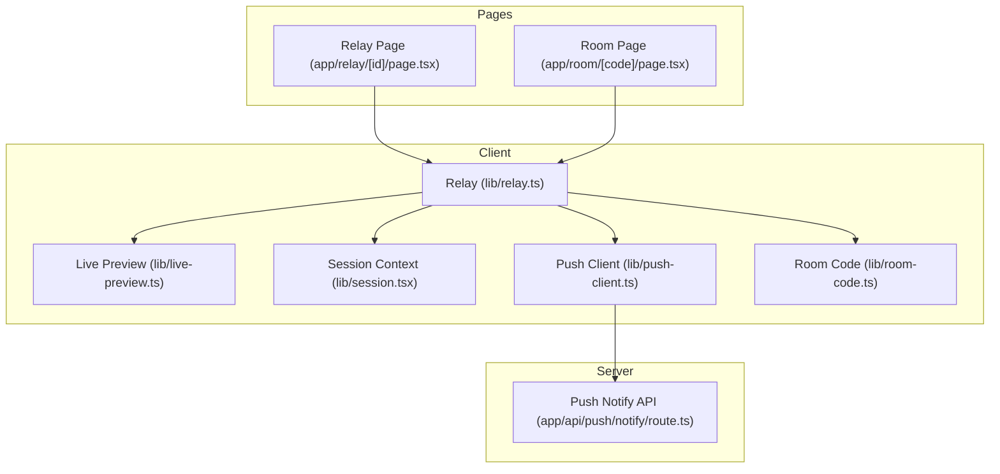
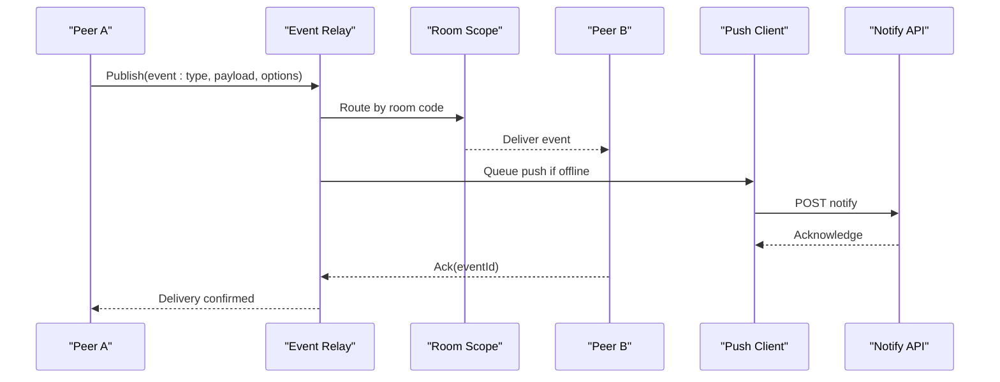
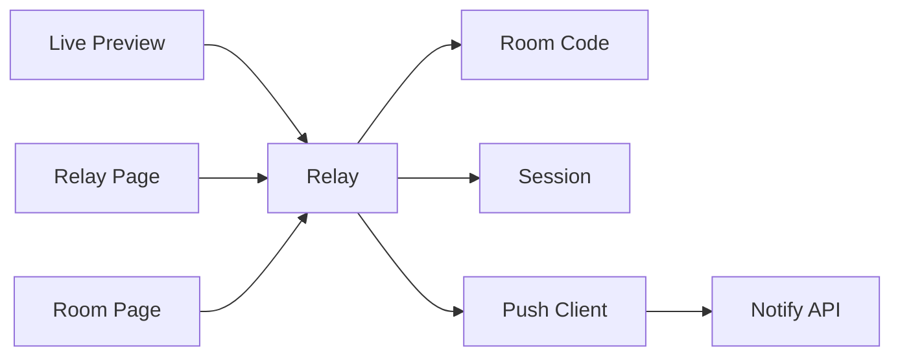

# Real-time Events

<cite>
**Referenced Files in This Document**
- [relay.ts](file://lib/relay.ts)
- [live-preview.ts](file://lib/live-preview.ts)
- [room-code.ts](file://lib/room-code.ts)
- [session.tsx](file://lib/session.tsx)
- [push-client.ts](file://lib/push-client.ts)
- [route.ts](file://app/api/push/notify/route.ts)
- [page.tsx](file://app/relay/[id]/page.tsx)
- [page.tsx](file://app/room/[code]/page.tsx)
</cite>

## Table of Contents
1. [Introduction](#introduction)
2. [Project Structure](#project-structure)
3. [Core Components](#core-components)
4. [Architecture Overview](#architecture-overview)
5. [Detailed Component Analysis](#detailed-component-analysis)
6. [Dependency Analysis](#dependency-analysis)
7. [Performance Considerations](#performance-considerations)
8. [Troubleshooting Guide](#troubleshooting-guide)
9. [Conclusion](#conclusion)

## Introduction
This document explains the real-time event system that enables collaborative features in the project. It covers event types, message formats, broadcasting mechanisms, propagation to connected participants, and local handling. It also provides practical guidance for creating custom events, filtering, priority handling, reliability guarantees, error recovery, and how events drive UI updates including optimistic updates and rollback behavior.

## Project Structure
The real-time event system is implemented primarily on the client side with a relay abstraction and room-based coordination. Key files include:
- lib/relay.ts: Event relay and transport abstraction
- lib/live-preview.ts: Live preview streaming and event emission
- lib/room-code.ts: Room code generation and resolution
- lib/session.tsx: Session state and event subscription context
- lib/push-client.ts: Push notification client integration
- app/api/push/notify/route.ts: Server-side push notification endpoint
- app/relay/[id]/page.tsx and app/room/[code]/page.tsx: Pages orchestrating relay and room sessions

**Diagram sources**
- [relay.ts](file://lib/relay.ts)
- [live-preview.ts](file://lib/live-preview.ts)
- [session.tsx](file://lib/session.tsx)
- [push-client.ts](file://lib/push-client.ts)
- [room-code.ts](file://lib/room-code.ts)
- [route.ts](file://app/api/push/notify/route.ts)
- [page.tsx](file://app/relay/[id]/page.tsx)
- [page.tsx](file://app/room/[code]/page.tsx)

**Section sources**
- [relay.ts](file://lib/relay.ts)
- [live-preview.ts](file://lib/live-preview.ts)
- [room-code.ts](file://lib/room-code.ts)
- [session.tsx](file://lib/session.tsx)
- [push-client.ts](file://lib/push-client.ts)
- [route.ts](file://app/api/push/notify/route.ts)
- [page.tsx](file://app/relay/[id]/page.tsx)
- [page.tsx](file://app/room/[code]/page.tsx)

## Core Components
- Event Relay: Central hub for publishing and subscribing to events within a session or across peers. It normalizes event payloads and manages transport channels.
- Live Preview Emitter: Generates and emits live preview events at intervals or on changes, ensuring minimal overhead and consistent frame pacing.
- Session Context: Holds active subscriptions, participant metadata, and event handlers; exposes hooks for components to consume events.
- Room Code Manager: Encodes and decodes room identifiers used to scope events and coordinate multi-user sessions.
- Push Notification Client: Bridges real-time events to push notifications when users are offline or backgrounded.

Key responsibilities:
- Normalize event schemas and validate payloads
- Broadcast events to all participants in a room
- Provide filtering and priority queues for high-priority actions
- Ensure reliable delivery via retries and acknowledgments where applicable
- Drive UI updates optimistically and roll back on failure

**Section sources**
- [relay.ts](file://lib/relay.ts)
- [live-preview.ts](file://lib/live-preview.ts)
- [session.tsx](file://lib/session.tsx)
- [room-code.ts](file://lib/room-code.ts)
- [push-client.ts](file://lib/push-client.ts)

## Architecture Overview
The event system follows a publish-subscribe model with room scoping. Participants join a room using a code, subscribe to event channels, and receive broadcasts from other participants. The relay abstracts underlying transports (e.g., WebRTC data channels, WebSocket, or server-backed channels). Live preview events are emitted periodically and broadcast to the room. Push notifications extend reach beyond active connections.

**Diagram sources**
- [relay.ts](file://lib/relay.ts)
- [live-preview.ts](file://lib/live-preview.ts)
- [push-client.ts](file://lib/push-client.ts)
- [route.ts](file://app/api/push/notify/route.ts)

## Detailed Component Analysis

### Event Types and Message Formats
- Event types include user presence, media control, capture triggers, layout changes, and live preview frames.
- Message format typically contains:
  - id: Unique event identifier
  - type: Event category
  - payload: Structured data specific to the event
  - roomId: Scopes the event to a collaboration session
  - timestamp: Time of emission
  - ackId: Optional acknowledgment reference
  - priority: Numeric priority for ordering and filtering

Practical examples:
- Custom event creation: Define a new type with a typed payload and publish through the relay with appropriate options.
- Event filtering: Subscribe with filters based on type, roomId, or payload fields.
- Priority handling: Assign higher priority to critical actions like capture triggers to ensure timely processing.

**Section sources**
- [relay.ts](file://lib/relay.ts)
- [live-preview.ts](file://lib/live-preview.ts)
- [session.tsx](file://lib/session.tsx)

### Broadcasting Mechanisms
- Room-scoped broadcasting ensures only participants in the same room receive events.
- The relay maintains participant lists and forwards messages efficiently.
- For large rooms, batching and throttling may be applied to reduce bandwidth usage.

Propagation flow:
- Publisher sends event to relay
- Relay validates and routes by roomId
- Relay delivers to subscribers and optionally queues push notifications
- Subscribers acknowledge receipt for reliability

**Section sources**
- [relay.ts](file://lib/relay.ts)
- [room-code.ts](file://lib/room-code.ts)

### Local Handling and UI Updates
- Components subscribe to events via session hooks and update state reactively.
- Optimistic updates apply UI changes immediately upon receiving an event, then reconcile with server or peer confirmations.
- Rollback mechanisms revert UI state if an event fails validation or is rejected by peers.

Optimistic update pattern:
- Apply change locally
- Wait for acknowledgment
- If acknowledged, keep state; otherwise, revert and show error

**Section sources**
- [session.tsx](file://lib/session.tsx)
- [relay.ts](file://lib/relay.ts)

### Reliability, Delivery Guarantees, and Error Recovery
- Acknowledgment-based delivery ensures events are processed by recipients.
- Retry policies handle transient network failures with exponential backoff.
- Dead-letter handling logs failed events for debugging and potential reprocessing.
- Conflict resolution strategies maintain consistency across peers.

Error recovery steps:
- Detect missing acknowledgments
- Retry with backoff
- Fallback to push notifications if connection drops
- Reconcile state differences on reconnect

**Section sources**
- [relay.ts](file://lib/relay.ts)
- [push-client.ts](file://lib/push-client.ts)
- [route.ts](file://app/api/push/notify/route.ts)

### Live Preview Integration
- Live preview emits frame events at controlled intervals to balance quality and performance.
- Events carry compressed image data or references to shared resources.
- Receivers decode and render frames while applying filters and layouts.

Flow:
- Capture frame
- Compress and package into event
- Broadcast to room
- Render on peers with minimal latency

**Section sources**
- [live-preview.ts](file://lib/live-preview.ts)
- [relay.ts](file://lib/relay.ts)

### Push Notifications Extension
- When participants are offline or backgrounded, events can be queued for push delivery.
- The push client serializes relevant event data and posts to the notify API.
- On device wake-up, the client fetches missed events and reconciles state.

Sequence:
- Event published
- Relay detects offline status
- Push client enqueues notification
- API acknowledges and stores payload
- Device receives push and syncs missed events

**Section sources**
- [push-client.ts](file://lib/push-client.ts)
- [route.ts](file://app/api/push/notify/route.ts)
- [relay.ts](file://lib/relay.ts)

## Dependency Analysis
The event system has clear dependencies between modules:
- Relay depends on room codes for scoping and session context for subscriptions
- Live preview depends on relay for broadcasting frames
- Push client depends on the notify API for offline delivery
- Pages orchestrate relay and session lifecycle

**Diagram sources**
- [relay.ts](file://lib/relay.ts)
- [room-code.ts](file://lib/room-code.ts)
- [session.tsx](file://lib/session.tsx)
- [live-preview.ts](file://lib/live-preview.ts)
- [push-client.ts](file://lib/push-client.ts)
- [route.ts](file://app/api/push/notify/route.ts)
- [page.tsx](file://app/relay/[id]/page.tsx)
- [page.tsx](file://app/room/[code]/page.tsx)

**Section sources**
- [relay.ts](file://lib/relay.ts)
- [room-code.ts](file://lib/room-code.ts)
- [session.tsx](file://lib/session.tsx)
- [live-preview.ts](file://lib/live-preview.ts)
- [push-client.ts](file://lib/push-client.ts)
- [route.ts](file://app/api/push/notify/route.ts)
- [page.tsx](file://app/relay/[id]/page.tsx)
- [page.tsx](file://app/room/[code]/page.tsx)

## Performance Considerations
- Throttle live preview events to match device capabilities and network conditions
- Batch multiple small events into single broadcasts when possible
- Use efficient serialization formats for payloads
- Implement selective subscriptions to reduce unnecessary processing
- Monitor memory usage during long-running sessions

[No sources needed since this section provides general guidance]

## Troubleshooting Guide
Common issues and resolutions:
- Missing acknowledgments: Check network connectivity and retry policies
- Duplicate events: Deduplicate using event IDs and timestamps
- High latency: Optimize payload size and reduce broadcast frequency
- Push not delivered: Verify API credentials and device permissions
- State inconsistencies: Implement reconciliation logic and force refresh on reconnect

Debugging tips:
- Log event lifecycle from publish to acknowledgment
- Inspect room membership and participant states
- Validate event schemas before processing

**Section sources**
- [relay.ts](file://lib/relay.ts)
- [push-client.ts](file://lib/push-client.ts)
- [route.ts](file://app/api/push/notify/route.ts)

## Conclusion
The real-time event system provides a robust foundation for collaborative features through reliable broadcasting, optimistic UI updates, and push notification support. By following the patterns outlined here-custom event creation, filtering, priority handling, and error recovery-you can build responsive and consistent multi-user experiences. Continuously monitor performance and reliability metrics to ensure optimal user experience across devices and network conditions.