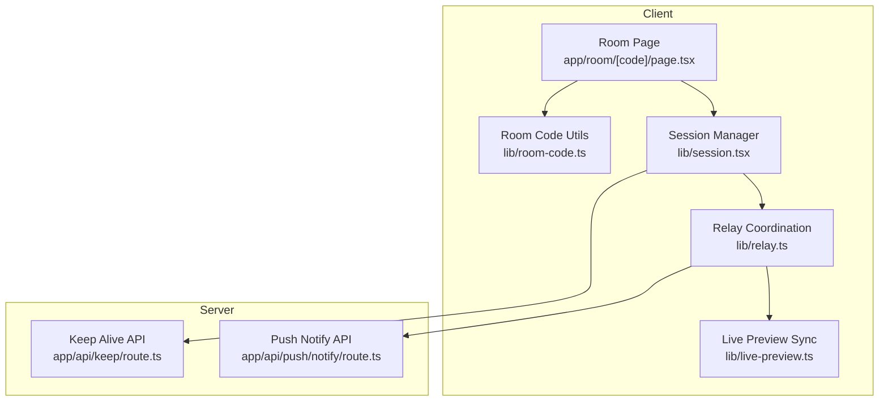
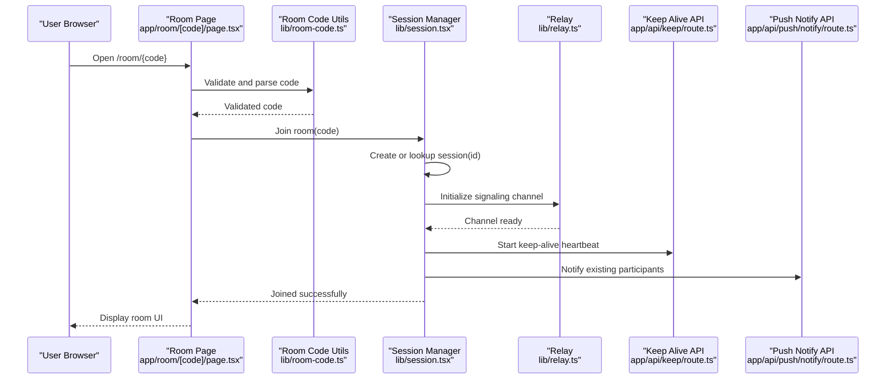
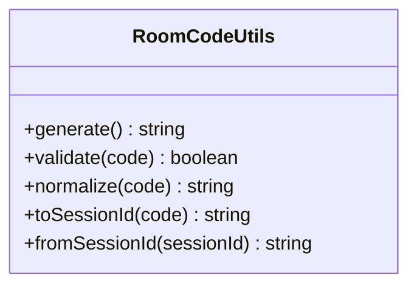
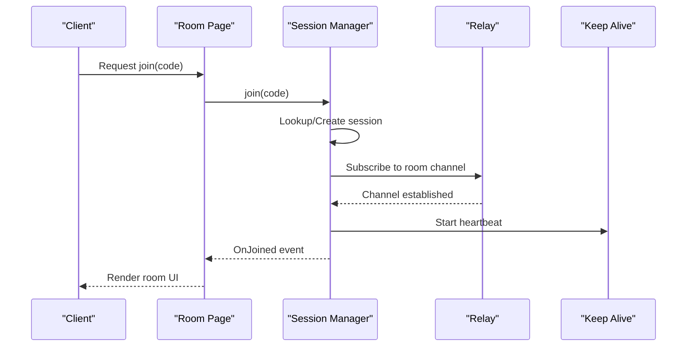
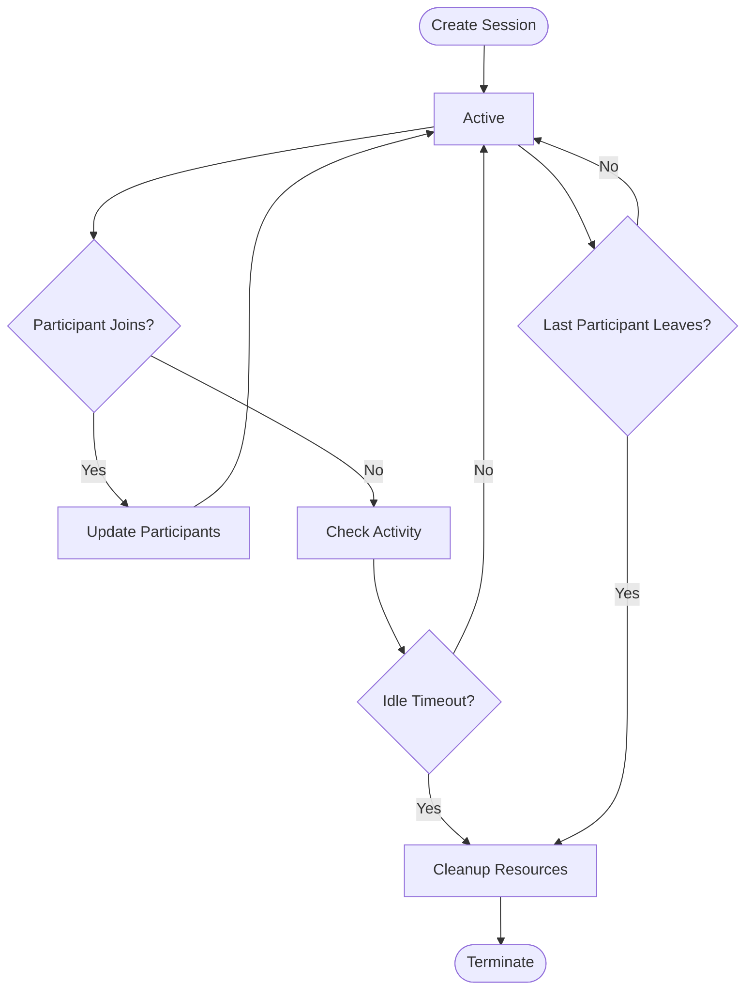
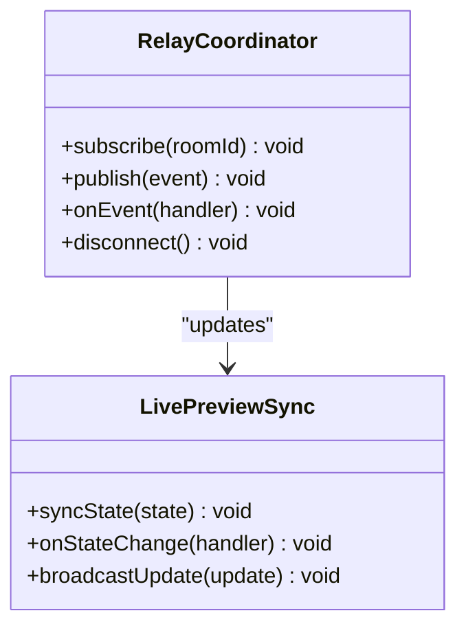
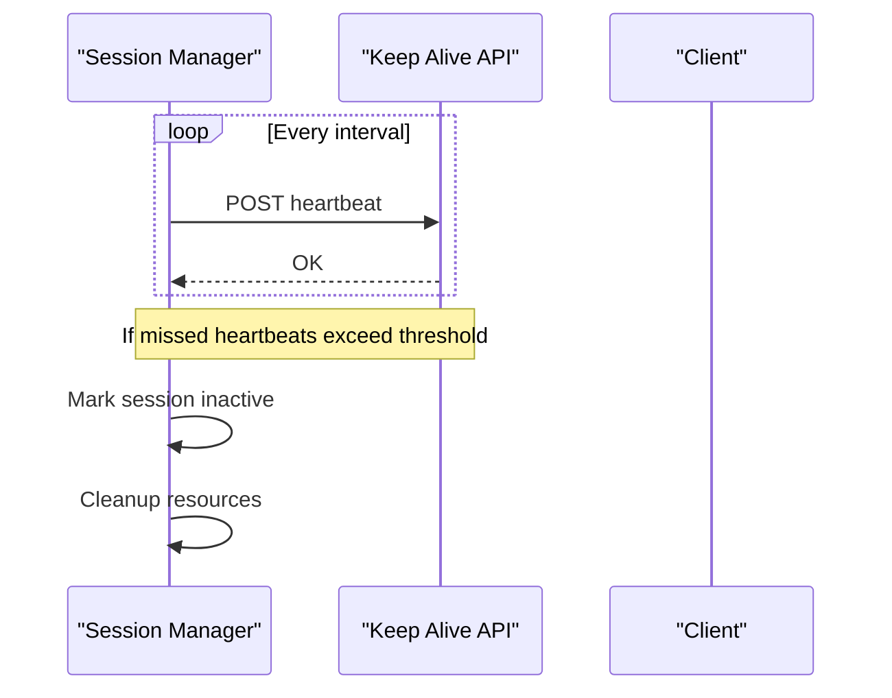
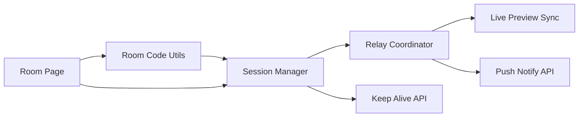

# Room Management

<cite>
**Referenced Files in This Document**
- [room-code.ts](file://lib/room-code.ts)
- [session.tsx](file://lib/session.tsx)
- [page.tsx](file://app/room/[code]/page.tsx)
- [relay.ts](file://lib/relay.ts)
- [live-preview.ts](file://lib/live-preview.ts)
- [route.ts](file://app/api/keep/route.ts)
- [route.ts](file://app/api/push/notify/route.ts)
</cite>

## Table of Contents
1. [Introduction](#introduction)
2. [Project Structure](#project-structure)
3. [Core Components](#core-components)
4. [Architecture Overview](#architecture-overview)
5. [Detailed Component Analysis](#detailed-component-analysis)
6. [Dependency Analysis](#dependency-analysis)
7. [Performance Considerations](#performance-considerations)
8. [Troubleshooting Guide](#troubleshooting-guide)
9. [Conclusion](#conclusion)

## Introduction
This document explains the room management system used by the photobooth application. It covers how rooms are created, how unique room codes are generated and mapped to session identifiers, how participants join and leave rooms, and how room state is synchronized across clients. It also documents permission handling, security measures, cleanup procedures, and practical examples for common workflows such as generating a room code, joining a room, and managing concurrent participants.

## Project Structure
The room management system spans client-side libraries and Next.js pages:
- Room code generation and validation utilities live under lib/room-code.ts.
- Session lifecycle and participant tracking are implemented in lib/session.tsx.
- The room entry page is app/room/[code]/page.tsx.
- Real-time relay and live preview coordination are handled by lib/relay.ts and lib/live-preview.ts.
- Server-side keep-alive and push notifications are exposed via app/api/keep/route.ts and app/api/push/notify/route.ts.

**Diagram sources**
- [room-code.ts](file://lib/room-code.ts)
- [session.tsx](file://lib/session.tsx)
- [page.tsx](file://app/room/[code]/page.tsx)
- [relay.ts](file://lib/relay.ts)
- [live-preview.ts](file://lib/live-preview.ts)
- [route.ts](file://app/api/keep/route.ts)
- [route.ts](file://app/api/push/notify/route.ts)

**Section sources**
- [room-code.ts](file://lib/room-code.ts)
- [session.tsx](file://lib/session.tsx)
- [page.tsx](file://app/room/[code]/page.tsx)
- [relay.ts](file://lib/relay.ts)
- [live-preview.ts](file://lib/live-preview.ts)
- [route.ts](file://app/api/keep/route.ts)
- [route.ts](file://app/api/push/notify/route.ts)

## Core Components
- Room Code Utilities: Generate short, collision-resistant codes and validate them before use.
- Session Manager: Owns per-room state, tracks participants, manages lifecycle events (join, leave, timeout), and coordinates with relay and live preview.
- Relay Coordination: Bridges peer-to-peer or server-mediated signaling for media and presence updates.
- Live Preview Sync: Synchronizes camera previews and UI state across participants within a room.
- Keep Alive API: Ensures long-lived sessions remain active and can trigger cleanup when clients disconnect.
- Push Notify API: Notifies participants about room events (e.g., new joiner, host actions).

Key responsibilities:
- Unique code generation and mapping to internal session IDs.
- Participant join/leave flows with permission checks.
- State synchronization across peers.
- Cleanup on disconnect or timeout.

**Section sources**
- [room-code.ts](file://lib/room-code.ts)
- [session.tsx](file://lib/session.tsx)
- [relay.ts](file://lib/relay.ts)
- [live-preview.ts](file://lib/live-preview.ts)
- [route.ts](file://app/api/keep/route.ts)
- [route.ts](file://app/api/push/notify/route.ts)

## Architecture Overview
The room architecture centers around a session-per-room model. A human-readable room code maps to an internal session identifier. Clients call into the session manager to join a room; the session manager validates the code, creates or retrieves the session, and registers the participant. Real-time updates flow through the relay layer, while the keep-alive endpoint maintains liveness and triggers cleanup when needed.

**Diagram sources**
- [page.tsx](file://app/room/[code]/page.tsx)
- [room-code.ts](file://lib/room-code.ts)
- [session.tsx](file://lib/session.tsx)
- [relay.ts](file://lib/relay.ts)
- [route.ts](file://app/api/keep/route.ts)
- [route.ts](file://app/api/push/notify/route.ts)

## Detailed Component Analysis

### Room Code Generation and Validation
Responsibilities:
- Generate short, readable, collision-resistant codes suitable for sharing.
- Validate format and length before use.
- Map codes to internal session identifiers securely.

Design considerations:
- Use a deterministic encoding scheme to ensure consistency across devices.
- Avoid ambiguous characters to reduce user errors.
- Provide helpers to quickly check validity and normalize input.

Practical example:
- Generate a new room code for a host creating a session.
- Validate a code provided by a participant attempting to join.

**Section sources**
- [room-code.ts](file://lib/room-code.ts)

#### Class Diagram: Room Code Utilities

**Diagram sources**
- [room-code.ts](file://lib/room-code.ts)

### Session Lifecycle and Participant Tracking
Responsibilities:
- Maintain per-room state including participants, permissions, and shared data.
- Handle join/leave events, timeouts, and cleanup.
- Coordinate with relay and live preview layers.

Lifecycle stages:
- Creation: When a host joins, create a session and assign a unique ID.
- Active: Participants join, permissions are enforced, and state sync occurs.
- Idle/Timeout: Inactivity triggers cleanup and resource release.
- Termination: Explicit close or last participant leaves.

Concurrency handling:
- Track participant identities and roles.
- Enforce role-based permissions for actions like starting/stopping sessions.
- Ensure thread-safe updates to shared state.

**Section sources**
- [session.tsx](file://lib/session.tsx)

#### Sequence Diagram: Join Flow

**Diagram sources**
- [session.tsx](file://lib/session.tsx)
- [relay.ts](file://lib/relay.ts)
- [route.ts](file://app/api/keep/route.ts)

#### Flowchart: Session Lifecycle

**Diagram sources**
- [session.tsx](file://lib/session.tsx)

### Relay Coordination and Live Preview Sync
Responsibilities:
- Manage real-time signaling channels for presence and media control.
- Broadcast participant join/leave and permission changes.
- Synchronize live preview states across participants.

Integration points:
- Session manager subscribes to room channels and forwards events.
- Live preview layer listens for state changes and updates UI accordingly.

**Section sources**
- [relay.ts](file://lib/relay.ts)
- [live-preview.ts](file://lib/live-preview.ts)

#### Class Diagram: Relay and Live Preview

**Diagram sources**
- [relay.ts](file://lib/relay.ts)
- [live-preview.ts](file://lib/live-preview.ts)

### Keep Alive and Push Notifications
Responsibilities:
- Keep alive: Periodic heartbeats to maintain session liveness and detect disconnects.
- Push notifications: Inform participants of important room events.

Operational details:
- Heartbeat interval should be tuned to balance responsiveness and overhead.
- Push messages should include minimal context to avoid spamming users.

**Section sources**
- [route.ts](file://app/api/keep/route.ts)
- [route.ts](file://app/api/push/notify/route.ts)

#### Sequence Diagram: Keep Alive and Cleanup

**Diagram sources**
- [route.ts](file://app/api/keep/route.ts)
- [session.tsx](file://lib/session.tsx)

## Dependency Analysis
The room management system has clear separation of concerns:
- Room code utilities are independent and provide pure functions for code handling.
- Session manager depends on relay and live preview for real-time features.
- Pages orchestrate user interactions and delegate to session and utilities.
- APIs provide server-side support for liveness and notifications.

**Diagram sources**
- [room-code.ts](file://lib/room-code.ts)
- [session.tsx](file://lib/session.tsx)
- [relay.ts](file://lib/relay.ts)
- [live-preview.ts](file://lib/live-preview.ts)
- [route.ts](file://app/api/keep/route.ts)
- [route.ts](file://app/api/push/notify/route.ts)
- [page.tsx](file://app/room/[code]/page.tsx)

**Section sources**
- [room-code.ts](file://lib/room-code.ts)
- [session.tsx](file://lib/session.tsx)
- [relay.ts](file://lib/relay.ts)
- [live-preview.ts](file://lib/live-preview.ts)
- [route.ts](file://app/api/keep/route.ts)
- [route.ts](file://app/api/push/notify/route.ts)
- [page.tsx](file://app/room/[code]/page.tsx)

## Performance Considerations
- Minimize payload size for real-time messages to reduce bandwidth usage.
- Debounce frequent state updates to prevent excessive re-renders.
- Use efficient data structures for participant lists and permissions.
- Tune keep-alive intervals based on expected network conditions.
- Implement backpressure mechanisms to handle high concurrency gracefully.

[No sources needed since this section provides general guidance]

## Troubleshooting Guide
Common issues and resolutions:
- Invalid room code: Ensure code format matches expected pattern and normalization steps.
- Join failures: Verify session creation succeeded and relay channel is available.
- Stale participants: Check keep-alive heartbeats and implement proper cleanup on disconnect.
- Permission errors: Confirm role assignments and access control rules are applied consistently.
- Live preview desync: Re-sync state after reconnecting and validate broadcast messages.

Debugging tips:
- Log join/leave events and permission checks.
- Monitor heartbeat success/failure rates.
- Inspect relay message queues for bottlenecks.

**Section sources**
- [session.tsx](file://lib/session.tsx)
- [relay.ts](file://lib/relay.ts)
- [route.ts](file://app/api/keep/route.ts)

## Conclusion
The room management system provides a robust foundation for collaborative photobooth experiences. By separating concerns between code generation, session management, real-time coordination, and server-side support, it ensures scalability, security, and reliability. Following the documented workflows and best practices will help maintain consistent behavior across diverse usage scenarios.

[No sources needed since this section summarizes without analyzing specific files]