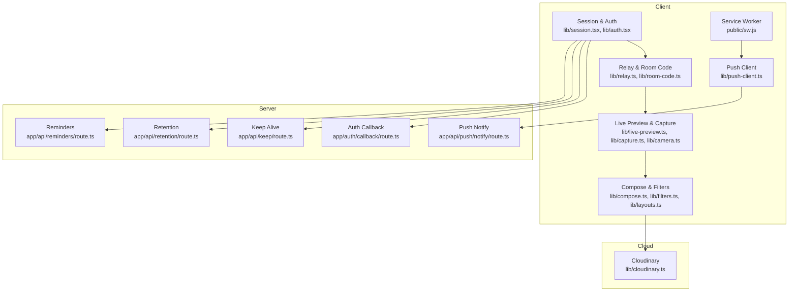
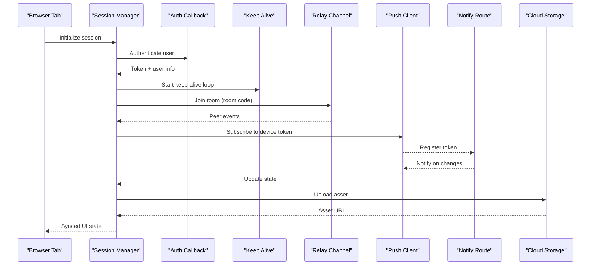
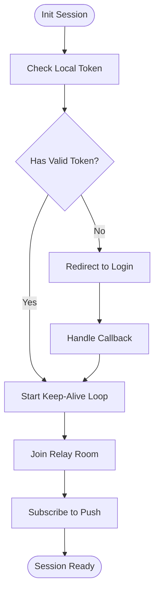
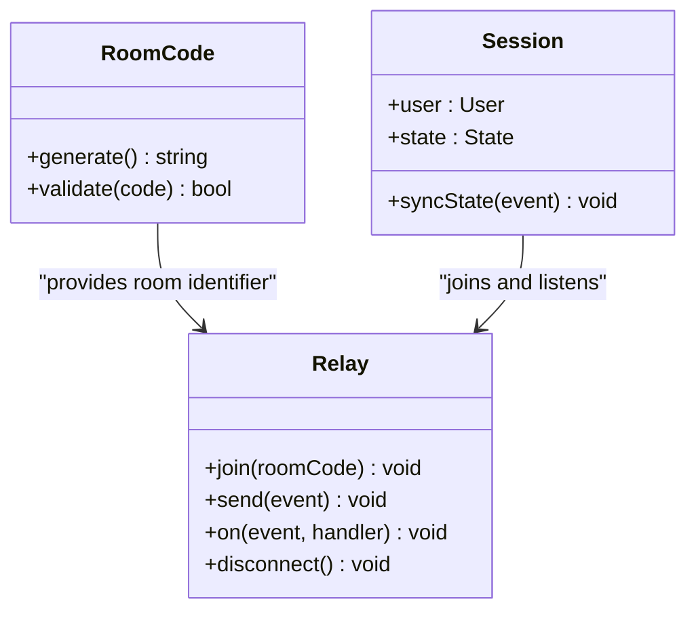
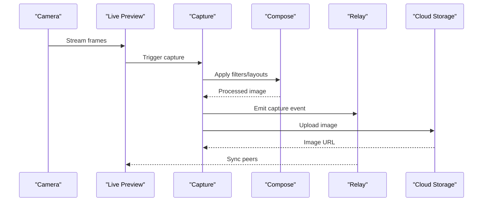
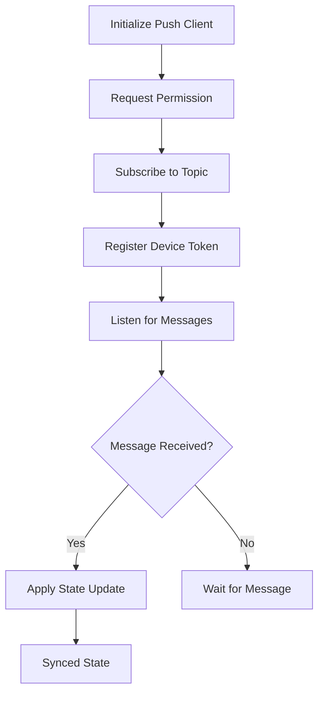
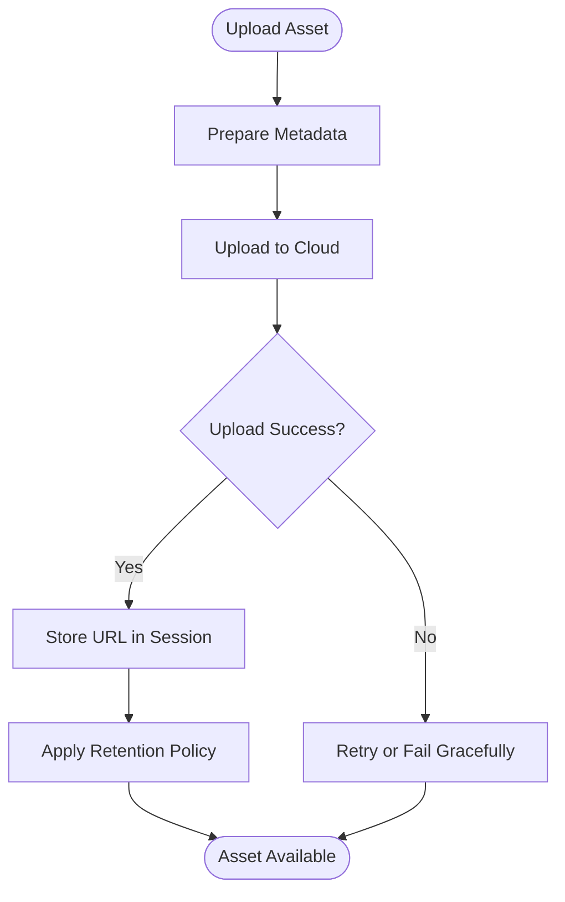
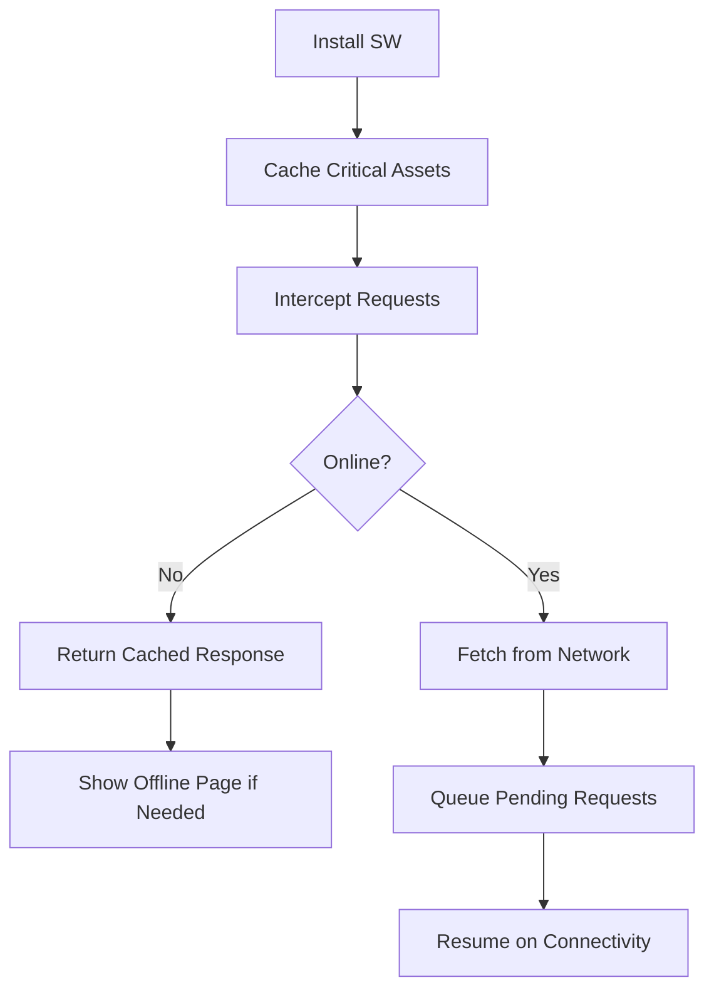
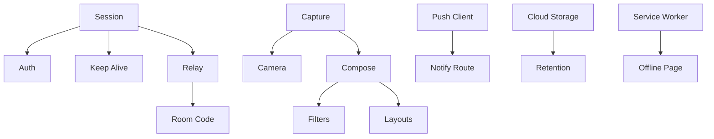

# Session Synchronization

<cite>
**Referenced Files in This Document**
- [session.tsx](file://lib/session.tsx)
- [auth.tsx](file://lib/auth.tsx)
- [push-client.ts](file://lib/push-client.ts)
- [push.ts](file://lib/push.ts)
- [relay.ts](file://lib/relay.ts)
- [room-code.ts](file://lib/room-code.ts)
- [live-preview.ts](file://lib/live-preview.ts)
- [capture.ts](file://lib/capture.ts)
- [compose.ts](file://lib/compose.ts)
- [cloudinary.ts](file://lib/cloudinary.ts)
- [retention.ts](file://lib/retention.ts)
- [streak.ts](file://lib/streak.ts)
- [camera.ts](file://lib/camera.ts)
- [filters.ts](file://lib/filters.ts)
- [layouts.ts](file://lib/layouts.ts)
- [scenes.ts](file://lib/scenes.ts)
- [segmentation.ts](file://lib/segmentation.ts)
- [sound.ts](file://lib/sound.ts)
- [recap.ts](file://lib/recap.ts)
- [photo-dates.ts](file://lib/photo-dates.ts)
- [prompts.ts](file://lib/prompts.ts)
- [stickers.ts](file://lib/sticker-assets.ts)
- [route.ts](file://app/api/keep/route.ts)
- [route.ts](file://app/api/push/notify/route.ts)
- [route.ts](file://app/api/reminders/route.ts)
- [route.ts](file://app/api/retention/route.ts)
- [route.ts](file://app/auth/callback/route.ts)
- [page.tsx](file://app/booth/page.tsx)
- [page.tsx](file://app/customize/page.tsx)
- [page.tsx](file://app/login/page.tsx)
- [page.tsx](file://app/relay/[id]/page.tsx)
- [page.tsx](file://app/relay/new/page.tsx)
- [page.tsx](file://app/room/[code]/page.tsx)
- [page.tsx](file://app/timeline/page.tsx)
- [layout.tsx](file://app/layout.tsx)
- [sw.js](file://public/sw.js)
- [offline.html](file://public/offline.html)
</cite>

## Table of Contents
1. [Introduction](#introduction)
2. [Project Structure](#project-structure)
3. [Core Components](#core-components)
4. [Architecture Overview](#architecture-overview)
5. [Detailed Component Analysis](#detailed-component-analysis)
6. [Dependency Analysis](#dependency-analysis)
7. [Performance Considerations](#performance-considerations)
8. [Troubleshooting Guide](#troubleshooting-guide)
9. [Conclusion](#conclusion)
10. [Appendices](#appendices)

## Introduction
This document explains how user sessions are synchronized across multiple devices and browsers within the project. It covers session persistence, state synchronization protocols, conflict resolution strategies, real-time updates, offline handling, and data consistency guarantees. Practical examples include synchronizing user preferences, photo states, and collaborative editing operations. Performance considerations such as bandwidth optimization and latency reduction are also addressed.

## Project Structure
The application is a Next.js app with client-side session management, push notifications, media capture, and cloud storage integration. Key areas relevant to session synchronization include:
- Client session and authentication utilities
- Real-time collaboration via relay and room code mechanisms
- Push notification client and server routes for cross-device updates
- Media capture and composition pipeline
- Cloud storage and retention policies
- Service worker and offline support

**Diagram sources**
- [session.tsx](file://lib/session.tsx)
- [auth.tsx](file://lib/auth.tsx)
- [relay.ts](file://lib/relay.ts)
- [room-code.ts](file://lib/room-code.ts)
- [live-preview.ts](file://lib/live-preview.ts)
- [capture.ts](file://lib/capture.ts)
- [camera.ts](file://lib/camera.ts)
- [compose.ts](file://lib/compose.ts)
- [filters.ts](file://lib/filters.ts)
- [layouts.ts](file://lib/layouts.ts)
- [push-client.ts](file://lib/push-client.ts)
- [sw.js](file://public/sw.js)
- [route.ts](file://app/auth/callback/route.ts)
- [route.ts](file://app/api/keep/route.ts)
- [route.ts](file://app/api/push/notify/route.ts)
- [route.ts](file://app/api/retention/route.ts)
- [route.ts](file://app/api/reminders/route.ts)
- [cloudinary.ts](file://lib/cloudinary.ts)

**Section sources**
- [session.tsx](file://lib/session.tsx)
- [auth.tsx](file://lib/auth.tsx)
- [relay.ts](file://lib/relay.ts)
- [room-code.ts](file://lib/room-code.ts)
- [live-preview.ts](file://lib/live-preview.ts)
- [capture.ts](file://lib/capture.ts)
- [camera.ts](file://lib/camera.ts)
- [compose.ts](file://lib/compose.ts)
- [filters.ts](file://lib/filters.ts)
- [layouts.ts](file://lib/layouts.ts)
- [push-client.ts](file://lib/push-client.ts)
- [sw.js](file://public/sw.js)
- [route.ts](file://app/auth/callback/route.ts)
- [route.ts](file://app/api/keep/route.ts)
- [route.ts](file://app/api/push/notify/route.ts)
- [route.ts](file://app/api/retention/route.ts)
- [route.ts](file://app/api/reminders/route.ts)
- [cloudinary.ts](file://lib/cloudinary.ts)

## Core Components
- Session and Authentication: Manages user identity, tokens, and session lifecycle across tabs and devices. Integrates with server auth callback and keep-alive endpoints.
- Relay and Room Code: Enables multi-device collaboration by creating rooms and relaying events between participants.
- Live Preview and Capture: Captures frames and streams previews; coordinates with compose and filters to produce final assets.
- Compose and Filters: Applies layouts, stickers, and filters; maintains local state that can be synced across devices.
- Push Notifications: Subscribes to device tokens and receives server-triggered updates to synchronize state across devices.
- Cloud Storage and Retention: Uploads assets to cloud storage and enforces retention policies.
- Service Worker and Offline Support: Caches critical assets and provides fallback pages when offline.

**Section sources**
- [session.tsx](file://lib/session.tsx)
- [auth.tsx](file://lib/auth.tsx)
- [relay.ts](file://lib/relay.ts)
- [room-code.ts](file://lib/room-code.ts)
- [live-preview.ts](file://lib/live-preview.ts)
- [capture.ts](file://lib/capture.ts)
- [compose.ts](file://lib/compose.ts)
- [filters.ts](file://lib/filters.ts)
- [layouts.ts](file://lib/layouts.ts)
- [push-client.ts](file://lib/push-client.ts)
- [cloudinary.ts](file://lib/cloudinary.ts)
- [retention.ts](file://lib/retention.ts)
- [sw.js](file://public/sw.js)
- [offline.html](file://public/offline.html)

## Architecture Overview
The session synchronization architecture combines client-side state management with server-backed coordination and cloud storage. Sessions are established via authentication callbacks and maintained through periodic keep-alive requests. Collaboration occurs through relay channels identified by room codes. Real-time updates are propagated using push notifications and direct relay messages. Assets are uploaded to cloud storage and governed by retention policies. Offline scenarios are handled via service worker caching and graceful degradation.

**Diagram sources**
- [auth.tsx](file://lib/auth.tsx)
- [route.ts](file://app/auth/callback/route.ts)
- [route.ts](file://app/api/keep/route.ts)
- [relay.ts](file://lib/relay.ts)
- [room-code.ts](file://lib/room-code.ts)
- [push-client.ts](file://lib/push-client.ts)
- [route.ts](file://app/api/push/notify/route.ts)
- [cloudinary.ts](file://lib/cloudinary.ts)

## Detailed Component Analysis

### Session and Authentication Flow
- Establishes user identity and tokens via an auth callback route.
- Maintains session continuity with periodic keep-alive requests.
- Persists session state locally and propagates updates to other tabs/devices via relay and push.

**Diagram sources**
- [auth.tsx](file://lib/auth.tsx)
- [route.ts](file://app/auth/callback/route.ts)
- [route.ts](file://app/api/keep/route.ts)
- [relay.ts](file://lib/relay.ts)
- [push-client.ts](file://lib/push-client.ts)

**Section sources**
- [auth.tsx](file://lib/auth.tsx)
- [route.ts](file://app/auth/callback/route.ts)
- [route.ts](file://app/api/keep/route.ts)
- [session.tsx](file://lib/session.tsx)

### Relay and Room Code Collaboration
- Creates or joins a room using a room code.
- Relays events between participants in real time.
- Coordinates state changes such as filter application, layout selection, and capture actions.

**Diagram sources**
- [room-code.ts](file://lib/room-code.ts)
- [relay.ts](file://lib/relay.ts)
- [session.tsx](file://lib/session.tsx)

**Section sources**
- [relay.ts](file://lib/relay.ts)
- [room-code.ts](file://lib/room-code.ts)
- [session.tsx](file://lib/session.tsx)

### Live Preview and Capture Pipeline
- Streams camera feed to preview canvas.
- Captures frames and applies filters/layouts.
- Publishes capture events to relay for synchronization.

**Diagram sources**
- [camera.ts](file://lib/camera.ts)
- [live-preview.ts](file://lib/live-preview.ts)
- [capture.ts](file://lib/capture.ts)
- [compose.ts](file://lib/compose.ts)
- [filters.ts](file://lib/filters.ts)
- [layouts.ts](file://lib/layouts.ts)
- [relay.ts](file://lib/relay.ts)
- [cloudinary.ts](file://lib/cloudinary.ts)

**Section sources**
- [camera.ts](file://lib/camera.ts)
- [live-preview.ts](file://lib/live-preview.ts)
- [capture.ts](file://lib/capture.ts)
- [compose.ts](file://lib/compose.ts)
- [filters.ts](file://lib/filters.ts)
- [layouts.ts](file://lib/layouts.ts)
- [relay.ts](file://lib/relay.ts)
- [cloudinary.ts](file://lib/cloudinary.ts)

### Push Notifications and Cross-Device Updates
- Subscribes to push notifications using a device token.
- Receives server-triggered updates to synchronize state across devices.
- Handles offline scenarios by queuing updates until connectivity resumes.

**Diagram sources**
- [push-client.ts](file://lib/push-client.ts)
- [push.ts](file://lib/push.ts)
- [route.ts](file://app/api/push/notify/route.ts)

**Section sources**
- [push-client.ts](file://lib/push-client.ts)
- [push.ts](file://lib/push.ts)
- [route.ts](file://app/api/push/notify/route.ts)

### Cloud Storage and Retention Policies
- Uploads images and assets to cloud storage.
- Enforces retention policies to manage storage lifecycle.
- Provides URLs for sharing and timeline display.

**Diagram sources**
- [cloudinary.ts](file://lib/cloudinary.ts)
- [retention.ts](file://lib/retention.ts)
- [route.ts](file://app/api/retention/route.ts)

**Section sources**
- [cloudinary.ts](file://lib/cloudinary.ts)
- [retention.ts](file://lib/retention.ts)
- [route.ts](file://app/api/retention/route.ts)

### Offline Handling and Service Worker
- Caches essential assets and pages for offline access.
- Displays a fallback page when offline.
- Queues network requests and syncs when connectivity resumes.

**Diagram sources**
- [sw.js](file://public/sw.js)
- [offline.html](file://public/offline.html)

**Section sources**
- [sw.js](file://public/sw.js)
- [offline.html](file://public/offline.html)

## Dependency Analysis
The session synchronization system depends on several modules:
- Session and Auth depend on server routes for authentication and keep-alive.
- Relay depends on room codes and peer-to-peer messaging.
- Capture and Compose depend on camera, filters, and layouts.
- Push Client depends on server notify routes.
- Cloud Storage depends on upload and retention services.
- Service Worker depends on caching strategies and offline pages.

**Diagram sources**
- [session.tsx](file://lib/session.tsx)
- [auth.tsx](file://lib/auth.tsx)
- [route.ts](file://app/api/keep/route.ts)
- [relay.ts](file://lib/relay.ts)
- [room-code.ts](file://lib/room-code.ts)
- [capture.ts](file://lib/capture.ts)
- [camera.ts](file://lib/camera.ts)
- [compose.ts](file://lib/compose.ts)
- [filters.ts](file://lib/filters.ts)
- [layouts.ts](file://lib/layouts.ts)
- [push-client.ts](file://lib/push-client.ts)
- [route.ts](file://app/api/push/notify/route.ts)
- [cloudinary.ts](file://lib/cloudinary.ts)
- [retention.ts](file://lib/retention.ts)
- [sw.js](file://public/sw.js)
- [offline.html](file://public/offline.html)

**Section sources**
- [session.tsx](file://lib/session.tsx)
- [auth.tsx](file://lib/auth.tsx)
- [route.ts](file://app/api/keep/route.ts)
- [relay.ts](file://lib/relay.ts)
- [room-code.ts](file://lib/room-code.ts)
- [capture.ts](file://lib/capture.ts)
- [camera.ts](file://lib/camera.ts)
- [compose.ts](file://lib/compose.ts)
- [filters.ts](file://lib/filters.ts)
- [layouts.ts](file://lib/layouts.ts)
- [push-client.ts](file://lib/push-client.ts)
- [route.ts](file://app/api/push/notify/route.ts)
- [cloudinary.ts](file://lib/cloudinary.ts)
- [retention.ts](file://lib/retention.ts)
- [sw.js](file://public/sw.js)
- [offline.html](file://public/offline.html)

## Performance Considerations
- Minimize payload size by compressing images and batching updates.
- Use debouncing and throttling for frequent state changes.
- Prioritize critical path assets for faster initial load.
- Implement efficient caching strategies in the service worker.
- Reduce network calls by leveraging local state reconciliation.
- Monitor bandwidth usage and adjust update frequency based on connectivity.

[No sources needed since this section provides general guidance]

## Troubleshooting Guide
Common issues and resolutions:
- Authentication failures: Verify token validity and server endpoint availability.
- Relay connection errors: Check room code correctness and network connectivity.
- Push notification not received: Ensure device token registration and permission grants.
- Upload failures: Inspect cloud storage credentials and retry logic.
- Offline mode problems: Validate service worker cache and fallback page rendering.

**Section sources**
- [auth.tsx](file://lib/auth.tsx)
- [route.ts](file://app/auth/callback/route.ts)
- [relay.ts](file://lib/relay.ts)
- [room-code.ts](file://lib/room-code.ts)
- [push-client.ts](file://lib/push-client.ts)
- [route.ts](file://app/api/push/notify/route.ts)
- [cloudinary.ts](file://lib/cloudinary.ts)
- [sw.js](file://public/sw.js)
- [offline.html](file://public/offline.html)

## Conclusion
The session synchronization mechanism integrates client-side state management with server-backed coordination and cloud storage. It supports real-time collaboration, cross-device updates, and offline resilience. By optimizing performance and ensuring data consistency, the system delivers a seamless user experience across multiple devices and browsers.

[No sources needed since this section summarizes without analyzing specific files]

## Appendices
- Practical Examples:
  - Synchronizing User Preferences: Use relay events to share filter and layout selections across devices.
  - Photo States: Coordinate capture and composition steps via relay and push notifications.
  - Collaborative Editing: Apply incremental updates to shared documents using conflict resolution strategies.

[No sources needed since this section provides conceptual content]