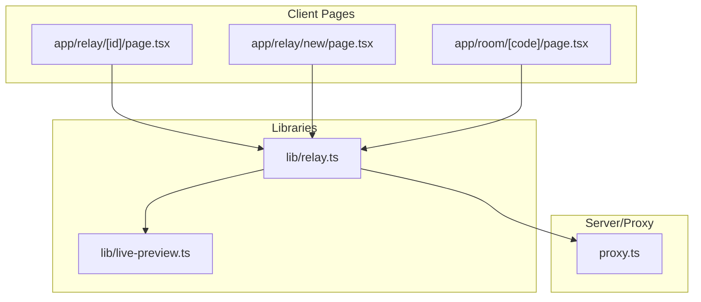
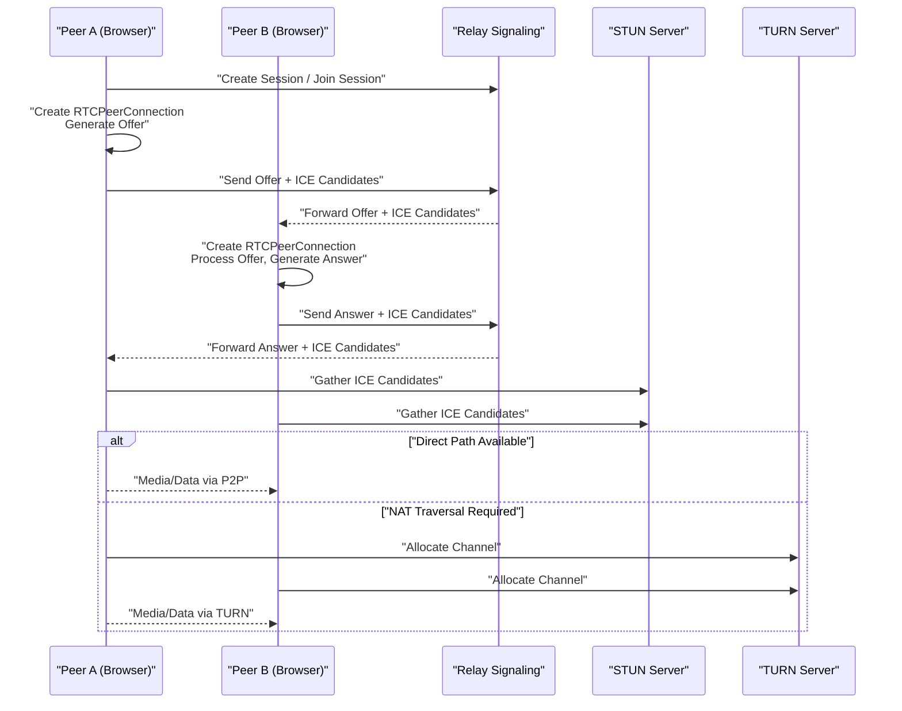
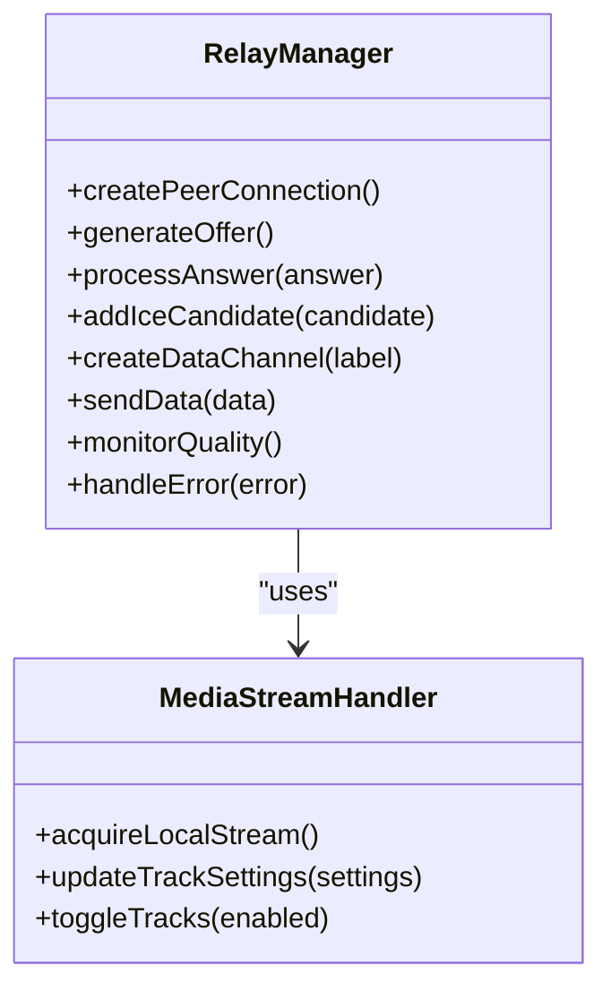
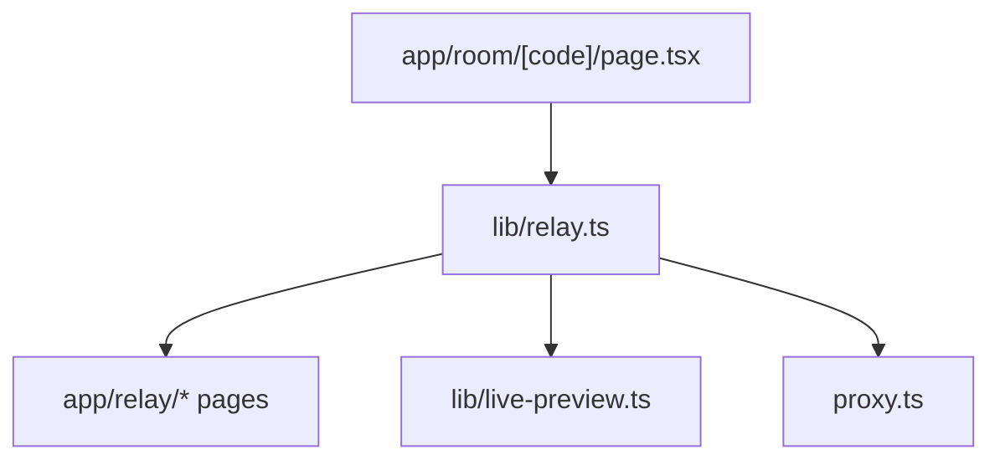

# WebRTC Implementation

<cite>
**Referenced Files in This Document**
- [relay.ts](file://lib/relay.ts)
- [live-preview.ts](file://lib/live-preview.ts)
- [page.tsx](file://app/relay/[id]/page.tsx)
- [page.tsx](file://app/relay/new/page.tsx)
- [page.tsx](file://app/room/[code]/page.tsx)
- [proxy.ts](file://proxy.ts)
</cite>

## Table of Contents
1. [Introduction](#introduction)
2. [Project Structure](#project-structure)
3. [Core Components](#core-components)
4. [Architecture Overview](#architecture-overview)
5. [Detailed Component Analysis](#detailed-component-analysis)
6. [Dependency Analysis](#dependency-analysis)
7. [Performance Considerations](#performance-considerations)
8. [Troubleshooting Guide](#troubleshooting-guide)
9. [Conclusion](#conclusion)

## Introduction
This document explains the WebRTC implementation used for real-time collaboration in the project. It covers peer-to-peer connection establishment, signaling mechanisms, and data channel communication. It also documents the relay server architecture that manages multiple concurrent connections and handles NAT traversal, including ICE candidate exchange, STUN/TURN usage, and connection quality monitoring. Practical examples are provided to guide creating peer connections, handling events, and managing data transmission, along with error handling strategies, fallbacks, and performance optimizations.

## Project Structure
The WebRTC-related logic is primarily implemented in:
- lib/relay.ts: Core WebRTC orchestration, signaling integration, and connection lifecycle management.
- lib/live-preview.ts: Media stream handling and live preview utilities.
- app/relay/[id]/page.tsx and app/relay/new/page.tsx: Relay endpoints for joining or creating sessions.
- app/room/[code]/page.tsx: Room-based UI and coordination for collaborative features.
- proxy.ts: Optional HTTP proxy configuration for local development and TURN relay scenarios.

**Diagram sources**
- [relay.ts](file://lib/relay.ts)
- [live-preview.ts](file://lib/live-preview.ts)
- [page.tsx](file://app/relay/[id]/page.tsx)
- [page.tsx](file://app/relay/new/page.tsx)
- [page.tsx](file://app/room/[code]/page.tsx)
- [proxy.ts](file://proxy.ts)

**Section sources**
- [relay.ts](file://lib/relay.ts)
- [live-preview.ts](file://lib/live-preview.ts)
- [page.tsx](file://app/relay/[id]/page.tsx)
- [page.tsx](file://app/relay/new/page.tsx)
- [page.tsx](file://app/room/[code]/page.tsx)
- [proxy.ts](file://proxy.ts)

## Core Components
- WebRTC Orchestration (lib/relay.ts): Manages PeerConnection creation, signaling message exchange, ICE candidate handling, and data channels. It coordinates connection states and integrates with the relay endpoint for session discovery and signaling transport.
- Live Preview Utilities (lib/live-preview.ts): Handles media stream acquisition, constraints, and preview rendering. It ensures consistent media settings across peers and provides helpers for toggling tracks and updating quality.
- Relay Endpoints (app/relay/*): Provide routes for creating and joining relay sessions. They coordinate signaling payloads and may expose a WebSocket or HTTP-based signaling channel depending on deployment.
- Room Coordination (app/room/[code]/page.tsx): Orchestrates room-level state and collaborator interactions, leveraging the relay layer for peer connectivity.
- Proxy Configuration (proxy.ts): Configures local development proxies and TURN relay behavior when needed.

Key responsibilities:
- Establishing secure peer connections using RTCPeerConnection.
- Exchanging SDP offers/answers and ICE candidates via signaling.
- Creating and managing RTCDataChannel for low-latency data transfer.
- Monitoring connection quality and adapting media/data parameters.
- Handling errors and fallbacks (e.g., switching from direct P2P to TURN relay).

**Section sources**
- [relay.ts](file://lib/relay.ts)
- [live-preview.ts](file://lib/live-preview.ts)
- [page.tsx](file://app/relay/[id]/page.tsx)
- [page.tsx](file://app/relay/new/page.tsx)
- [page.tsx](file://app/room/[code]/page.tsx)
- [proxy.ts](file://proxy.ts)

## Architecture Overview
The system uses a hybrid signaling approach where peers exchange SDP and ICE candidates through a relay service. Direct media paths are preferred; if NAT traversal fails, traffic is routed via TURN servers. Data channels carry collaboration payloads while media streams provide live previews.

**Diagram sources**
- [relay.ts](file://lib/relay.ts)
- [page.tsx](file://app/relay/[id]/page.tsx)
- [page.tsx](file://app/relay/new/page.tsx)
- [proxy.ts](file://proxy.ts)

## Detailed Component Analysis

### WebRTC Orchestration (lib/relay.ts)
Responsibilities:
- Create and configure RTCPeerConnection instances with appropriate ICE servers (STUN/TURN).
- Manage signaling flow: offer generation, answer processing, and ICE candidate exchange.
- Establish RTCDataChannel for collaboration data and handle open/message/close events.
- Monitor connection states and quality metrics (bandwidth, packet loss, jitter).
- Implement fallback strategies: switch to TURN when direct connectivity fails.

Implementation patterns:
- Centralized connection manager with per-peer lifecycle tracking.
- Event-driven signaling integration with retry and timeout handling.
- Quality monitoring hooks to adapt bitrate or codec preferences dynamically.

**Diagram sources**
- [relay.ts](file://lib/relay.ts)
- [live-preview.ts](file://lib/live-preview.ts)

Practical example references:
- Creating a peer connection and exchanging SDP: see [relay.ts](file://lib/relay.ts)
- Handling ICE candidates and signaling messages: see [relay.ts](file://lib/relay.ts)
- Managing data channels for collaboration payloads: see [relay.ts](file://lib/relay.ts)

**Section sources**
- [relay.ts](file://lib/relay.ts)

### Live Preview Utilities (lib/live-preview.ts)
Responsibilities:
- Acquire local camera/microphone streams with constraints.
- Render live preview elements and manage track visibility.
- Adjust media settings (resolution, frame rate) based on network conditions.

Implementation patterns:
- Stream abstraction with centralized constraint management.
- Reactive updates to track properties for adaptive quality.

Practical example references:
- Stream acquisition and preview setup: see [live-preview.ts](file://lib/live-preview.ts)
- Track toggling and quality adjustments: see [live-preview.ts](file://lib/live-preview.ts)

**Section sources**
- [live-preview.ts](file://lib/live-preview.ts)

### Relay Endpoints (app/relay/[id]/page.tsx and app/relay/new/page.tsx)
Responsibilities:
- Provide endpoints for session creation and joining.
- Coordinate signaling payload routing between peers.
- Optionally integrate with WebSocket or HTTP-based signaling backends.

Implementation patterns:
- Route handlers that validate session IDs and forward signaling messages.
- State synchronization for active sessions and participant lists.

Practical example references:
- Joining an existing relay session: see [page.tsx](file://app/relay/[id]/page.tsx)
- Creating a new relay session: see [page.tsx](file://app/relay/new/page.tsx)

**Section sources**
- [page.tsx](file://app/relay/[id]/page.tsx)
- [page.tsx](file://app/relay/new/page.tsx)

### Room Coordination (app/room/[code]/page.tsx)
Responsibilities:
- Manage room-level state and collaborator interactions.
- Integrate with relay layer to establish peer connections within a room context.
- Handle user roles and permissions for collaborative actions.

Implementation patterns:
- Room state store with event propagation to connected peers.
- Integration hooks for WebRTC signaling and data channels.

Practical example references:
- Room initialization and peer coordination: see [page.tsx](file://app/room/[code]/page.tsx)

**Section sources**
- [page.tsx](file://app/room/[code]/page.tsx)

### Proxy Configuration (proxy.ts)
Responsibilities:
- Configure local development proxies for signaling and TURN services.
- Facilitate TURN relay testing and debugging in constrained environments.

Implementation patterns:
- Environment-aware proxy rules for development vs production.
- TURN server URL mapping and credential handling.

Practical example references:
- TURN and signaling proxy setup: see [proxy.ts](file://proxy.ts)

**Section sources**
- [proxy.ts](file://proxy.ts)

## Dependency Analysis
The WebRTC layer depends on signaling endpoints and media utilities. The following diagram shows key dependencies and interactions:

**Diagram sources**
- [relay.ts](file://lib/relay.ts)
- [page.tsx](file://app/relay/[id]/page.tsx)
- [page.tsx](file://app/relay/new/page.tsx)
- [page.tsx](file://app/room/[code]/page.tsx)
- [live-preview.ts](file://lib/live-preview.ts)
- [proxy.ts](file://proxy.ts)

**Section sources**
- [relay.ts](file://lib/relay.ts)
- [page.tsx](file://app/relay/[id]/page.tsx)
- [page.tsx](file://app/relay/new/page.tsx)
- [page.tsx](file://app/room/[code]/page.tsx)
- [live-preview.ts](file://lib/live-preview.ts)
- [proxy.ts](file://proxy.ts)

## Performance Considerations
- ICE Candidate Optimization: Prefer host candidates first, then server-reflexive, and finally relayed candidates. Use STUN servers to improve direct connectivity success rates.
- TURN Fallback: Automatically route media through TURN when direct paths fail. Ensure TURN credentials are valid and servers are geographically close to reduce latency.
- Bandwidth Adaptation: Monitor bandwidth estimates and adjust video resolution/frame rate accordingly. Use scalable video codecs (VP8/VP9/H.264) and enable simulcast if supported.
- Data Channel Tuning: Configure maxRetransmits and protocol (TCP/UDP) based on payload type. For loss-tolerant data, prefer UDP; for reliable delivery, use TCP with appropriate retransmission limits.
- Connection Quality Monitoring: Track packet loss, jitter, and round-trip time. Trigger adaptive strategies such as lowering bitrate or switching codecs when thresholds are exceeded.
- Resource Management: Reuse PeerConnections where possible and properly release media tracks to avoid memory leaks.

[No sources needed since this section provides general guidance]

## Troubleshooting Guide
Common issues and resolutions:
- ICE Gathering Failures: Verify STUN/TURN server configurations and firewall rules. Check browser console for ICE candidate logs and ensure candidates are exchanged correctly.
- Signaling Errors: Validate signaling payload formats and ensure both peers receive offers/answers and ICE candidates. Implement retries and timeouts for robustness.
- NAT Traversal Problems: If direct connections fail, confirm TURN relay availability and credentials. Test with different networks to isolate client-side restrictions.
- Data Channel Issues: Ensure channels are opened before sending data. Handle open/error/close events and implement reconnection logic if channels drop.
- Media Quality Degradation: Monitor bandwidth and adjust constraints dynamically. Switch to lower resolutions or frame rates under constrained conditions.

Practical references:
- Error handling and fallback strategies: see [relay.ts](file://lib/relay.ts)
- Media stream troubleshooting: see [live-preview.ts](file://lib/live-preview.ts)
- Relay endpoint diagnostics: see [page.tsx](file://app/relay/[id]/page.tsx), [page.tsx](file://app/relay/new/page.tsx)

**Section sources**
- [relay.ts](file://lib/relay.ts)
- [live-preview.ts](file://lib/live-preview.ts)
- [page.tsx](file://app/relay/[id]/page.tsx)
- [page.tsx](file://app/relay/new/page.tsx)

## Conclusion
The WebRTC implementation provides a robust foundation for real-time collaboration by combining peer-to-peer connectivity with a flexible signaling layer and adaptive media handling. Proper configuration of STUN/TURN servers, careful ICE candidate management, and proactive quality monitoring ensure reliable performance across diverse network conditions. By following the documented patterns and best practices, developers can extend and optimize the system for specific use cases while maintaining high availability and low latency.

[No sources needed since this section summarizes without analyzing specific files]