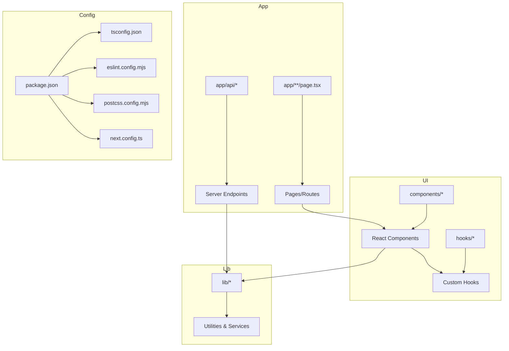
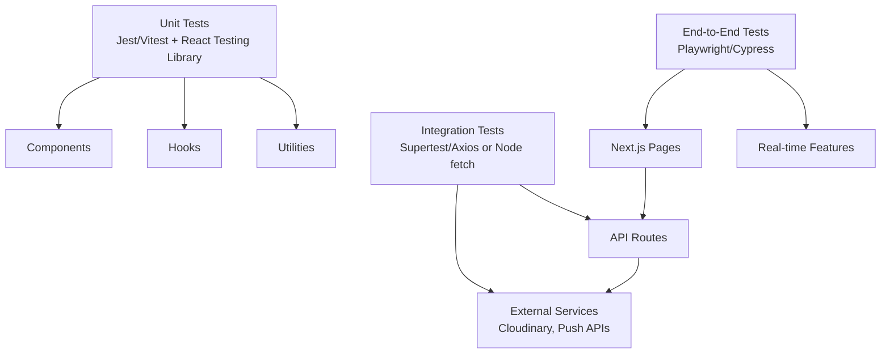
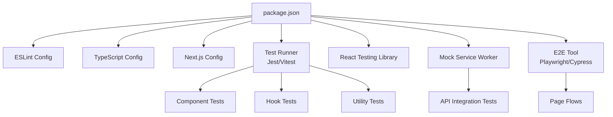

# Testing Strategy

<cite>
**Referenced Files in This Document**
- [package.json](file://package.json)
- [eslint.config.mjs](file://eslint.config.mjs)
- [postcss.config.mjs](file://postcss.config.mjs)
- [tsconfig.json](file://tsconfig.json)
- [next.config.ts](file://next.config.ts)
- [app/api/keep/route.ts](file://app/api/keep/route.ts)
- [app/api/push/notify/route.ts](file://app/api/push/notify/route.ts)
- [app/api/reminders/route.ts](file://app/api/reminders/route.ts)
- [app/api/retention/route.ts](file://app/api/retention/route.ts)
- [components/CameraPreview.tsx](file://components/CameraPreview.tsx)
- [hooks/useCamera.ts](file://hooks/useCamera.ts)
- [lib/camera.ts](file://lib/camera.ts)
- [lib/capture.ts](file://lib/capture.ts)
- [lib/cloudinary.ts](file://lib/cloudinary.ts)
- [lib/live-preview.ts](file://lib/live-preview.ts)
- [lib/session.tsx](file://lib/session.tsx)
- [lib/auth.tsx](file://lib/auth.tsx)
</cite>

## Table of Contents
1. Introduction
2. Project Structure
3. Core Components
4. Architecture Overview
5. Detailed Component Analysis
6. Dependency Analysis
7. Performance Considerations
8. Troubleshooting Guide
9. Conclusion

## Introduction
This document defines the testing strategy and quality assurance processes for the project. It covers code quality tooling (ESLint), styling automation (PostCSS), type safety and compilation (TypeScript), unit testing approaches for React components, custom hooks, and utility functions, integration testing strategies for API endpoints and external services, end-to-end testing considerations for user workflows and real-time features, and guidelines for test organization, mocking strategies, and continuous integration setup. The guidance is grounded in the existing configuration files and application structure to ensure practical applicability.

## Project Structure
The project follows a Next.js App Router layout with:
- API routes under app/api for server-side endpoints
- UI components under components
- Custom hooks under hooks
- Shared utilities under lib
- Build and tooling configurations at the repository root

[No sources needed since this diagram shows conceptual workflow, not actual code structure]

## Core Components
This section outlines the foundational quality and testing infrastructure present in the project.

- ESLint configuration for code quality and consistency
- PostCSS configuration for styling automation and optimization
- TypeScript configuration for type safety and compilation settings
- Next.js configuration influencing runtime behavior and build-time optimizations

These tools collectively establish a baseline for consistent code style, robust types, and optimized assets. They also provide hooks for automated checks in CI pipelines.

**Section sources**
- [eslint.config.mjs](file://eslint.config.mjs)
- [postcss.config.mjs](file://postcss.config.mjs)
- [tsconfig.json](file://tsconfig.json)
- [next.config.ts](file://next.config.ts)
- [package.json](file://package.json)

## Architecture Overview
The testing architecture spans three layers:
- Unit tests for pure logic and small units (utilities, hooks, components)
- Integration tests for API routes and external service interactions
- End-to-end tests for user workflows across pages and real-time features

[No sources needed since this diagram shows conceptual workflow, not actual code structure]

## Detailed Component Analysis

### ESLint Configuration for Code Quality and Consistency
- Purpose: Enforce consistent code style, catch common errors, and standardize patterns across the codebase.
- Typical responsibilities:
  - Parser and plugin selection for modern JavaScript/TypeScript
  - Rules for formatting, imports, complexity, and best practices
  - Environment definitions for browser, Node, and Next.js
- How it integrates:
  - Executed via npm scripts defined in package.json
  - Can be extended by IDE integrations and pre-commit hooks
  - CI jobs can fail on lint errors to maintain quality gates

Practical guidance:
- Add rules that prevent unsafe patterns and enforce consistent naming
- Configure environment flags for Next.js and browser APIs
- Use plugins for React and TypeScript to improve DX and correctness

**Section sources**
- [eslint.config.mjs](file://eslint.config.mjs)
- [package.json](file://package.json)

### PostCSS Configuration for Styling Automation and Optimization
- Purpose: Process CSS through a pipeline that supports modern syntax, autoprefixing, and minification.
- Typical responsibilities:
  - Enable Tailwind or other preprocessors if configured
  - Apply autoprefixer for cross-browser compatibility
  - Optimize output for production builds
- How it integrates:
  - Integrated into the Next.js build process
  - Works alongside CSS modules or global styles as needed

Practical guidance:
- Ensure vendor prefixes are applied automatically
- Keep CSS modular and avoid global overrides where possible
- Validate CSS changes in both dev and prod modes

**Section sources**
- [postcss.config.mjs](file://postcss.config.mjs)
- [next.config.ts](file://next.config.ts)

### TypeScript Configuration for Type Safety and Compilation Settings
- Purpose: Provide strict type checking, module resolution, and compilation targets aligned with Next.js runtime.
- Typical responsibilities:
  - Strict mode enabled for safer code
  - Path aliases for cleaner imports
  - JSX and module settings compatible with Next.js
- How it integrates:
  - Used by the editor and build system
  - Ensures type-safe usage of libraries and internal modules

Practical guidance:
- Enable strict null checks and no implicit any
- Define path mappings for internal packages
- Keep target and module settings aligned with Next.js requirements

**Section sources**
- [tsconfig.json](file://tsconfig.json)
- [next.config.ts](file://next.config.ts)

### Unit Testing Approaches for React Components, Custom Hooks, and Utility Functions
- Tools:
  - Jest or Vitest for test runner and assertions
  - React Testing Library for component interactions
  - MSW for mocking network requests when needed
- Component testing:
  - Render components with minimal required props
  - Assert visible outputs and user interactions
  - Mock external dependencies (e.g., camera, push notifications)
- Hook testing:
  - Use renderHook to exercise custom hooks
  - Assert state transitions and side effects
- Utility functions:
  - Test pure functions with various inputs and expected outputs
  - Cover edge cases and error paths

Practical examples:
- Camera preview component: mock media stream access and assert rendering states
- useCamera hook: simulate device permissions and track state updates
- Capture utilities: verify image processing steps and error handling

**Section sources**
- [components/CameraPreview.tsx](file://components/CameraPreview.tsx)
- [hooks/useCamera.ts](file://hooks/useCamera.ts)
- [lib/camera.ts](file://lib/camera.ts)
- [lib/capture.ts](file://lib/capture.ts)
- [lib/live-preview.ts](file://lib/live-preview.ts)
- [package.json](file://package.json)

### Integration Testing Strategies for API Endpoints and External Service Interactions
- API routes:
  - Use Supertest or Node fetch to send HTTP requests to Next.js API routes
  - Mock database calls and third-party SDKs
  - Validate status codes, response shapes, and error messages
- External services:
  - Cloudinary uploads: mock upload responses and validate parameters
  - Push notification APIs: mock token registration and delivery results
- Real-time features:
  - Simulate WebSocket events or room state changes
  - Verify client reactions to server events

Practical examples:
- POST /api/keep: assert retention policy application and response payload
- POST /api/push/notify: mock push provider and confirm notification triggers
- POST /api/reminders: validate reminder scheduling logic
- POST /api/retention: check retention duration calculations

**Section sources**
- [app/api/keep/route.ts](file://app/api/keep/route.ts)
- [app/api/push/notify/route.ts](file://app/api/push/notify/route.ts)
- [app/api/reminders/route.ts](file://app/api/reminders/route.ts)
- [app/api/retention/route.ts](file://app/api/retention/route.ts)
- [lib/cloudinary.ts](file://lib/cloudinary.ts)
- [lib/session.tsx](file://lib/session.tsx)
- [lib/auth.tsx](file://lib/auth.tsx)

### End-to-End Testing Considerations for User Workflows and Real-Time Features
- Tooling:
  - Playwright or Cypress for browser automation
- Coverage areas:
  - Authentication flows and session persistence
  - Camera capture sequence and photo strip generation
  - Room creation, joining, and live interactions
  - Push notification opt-in and delivery confirmation
- Real-time aspects:
  - Simulate multiple clients and verify synchronization
  - Handle timeouts and reconnect scenarios

Practical examples:
- Complete booth flow: login -> select role -> capture photos -> apply filters -> generate strip
- Relay workflow: create relay, share link, join from another device, sync timeline
- Reminder and retention: schedule reminders and verify retention actions

**Section sources**
- [lib/session.tsx](file://lib/session.tsx)
- [lib/auth.tsx](file://lib/auth.tsx)
- [lib/live-preview.ts](file://lib/live-preview.ts)
- [package.json](file://package.json)

### Test Organization, Mocking Strategies, and Continuous Integration Setup
- Test organization:
  - Group tests by feature or module (components, hooks, utils, api)
  - Separate unit, integration, and e2e directories
  - Use descriptive file names reflecting tested functionality
- Mocking strategies:
  - Network mocks with MSW or jest-fetch-mock
  - Browser APIs (camera, storage, push) via vitest/jest globals or custom mocks
  - Time-based operations with fake timers
- CI setup:
  - Install dependencies, run linters, type checks, unit tests, integration tests, and e2e tests
  - Cache node_modules and build artifacts for speed
  - Fail fast on lint/type/test failures; collect coverage reports

Practical guidance:
- Define npm scripts for each test tier
- Use environment variables for test-specific configs
- Generate and publish coverage reports to track regressions

**Section sources**
- [package.json](file://package.json)

## Dependency Analysis
Testing dependencies and their relationships influence how tests are structured and executed.

**Diagram sources**
- [package.json](file://package.json)

**Section sources**
- [package.json](file://package.json)

## Performance Considerations
- Keep unit tests fast by isolating side effects and using lightweight mocks
- Parallelize test execution where supported
- Avoid heavy DOM manipulations in unit tests; prefer shallow renders and targeted assertions
- For integration tests, mock slow external services and limit network calls
- For e2e tests, use headless browsers and optimize test data setup

[No sources needed since this section provides general guidance]

## Troubleshooting Guide
Common issues and resolutions:
- Linting failures:
  - Run linter locally with verbose output
  - Fix rule violations incrementally; add exceptions only when justified
- TypeScript errors:
  - Resolve strict mode conflicts; update type definitions
  - Ensure path aliases match tsconfig settings
- Test flakiness:
  - Stabilize timers and async operations
  - Use deterministic mocks for time-dependent logic
- API integration tests:
  - Verify environment variables and mocked endpoints
  - Check request/response schemas and error paths
- E2E instability:
  - Increase timeouts for slow operations
  - Seed consistent test data and reset state between runs

**Section sources**
- [eslint.config.mjs](file://eslint.config.mjs)
- [tsconfig.json](file://tsconfig.json)
- [package.json](file://package.json)

## Conclusion
By combining ESLint for code quality, PostCSS for styling automation, and TypeScript for type safety, the project establishes a strong foundation for reliable development. A layered testing approach—unit, integration, and end-to-end—ensures correctness across components, hooks, utilities, API routes, and user workflows. Organized test suites, robust mocking strategies, and CI integration keep quality high and regressions low. Adopting these practices will improve maintainability, confidence in releases, and overall product stability.